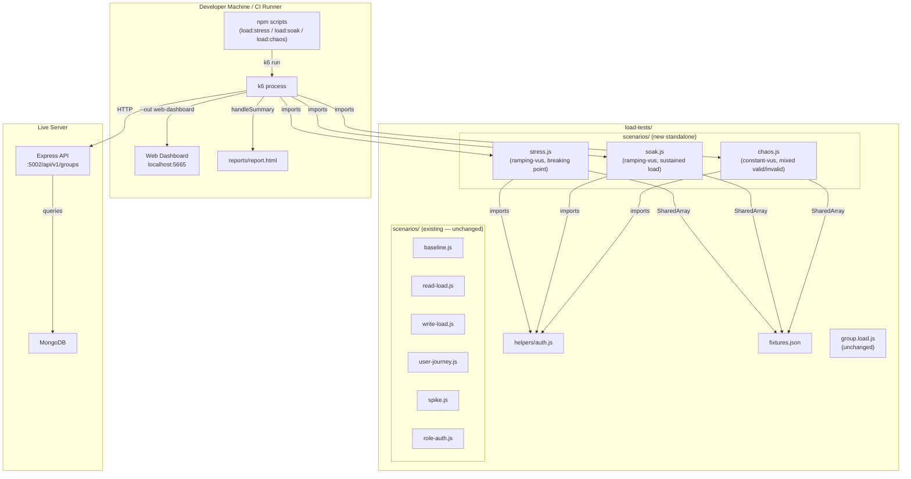

# Design Document: advanced-load-scenarios

## Overview

This document describes the technical design for three new standalone k6 load testing scenarios that extend the existing Group API load testing suite: **Stress Test** (find the breaking point), **Soak Test** (detect memory leaks and degradation), and **Chaos Test** (test failure resilience). Each scenario is a self-contained k6 script with its own `options` object, thresholds, and `handleSummary` — they do not integrate into the existing `group.load.js` orchestrator.

All three scenarios reuse the existing fixture infrastructure (`fixtures.json` via SharedArray) and auth helper (`helpers/auth.js`), but define their own k6 options inline rather than importing from `config/thresholds.js`.

### Key Design Decisions

- **Standalone execution**: Each scenario defines its own `export const options` with inline scenarios, thresholds, and stages. They are invoked directly via `k6 run load-tests/scenarios/{name}.js` — not through `group.load.js`.
- **Environment-based profiles**: Stress and Soak tests support `STRESS_PROFILE=production` and `SOAK_PROFILE=production` environment variables to switch between local (short) and production (long) stage configurations.
- **Reuse existing infrastructure**: All scenarios import `helpers/auth.js` and load `fixtures.json` via SharedArray — no new seed logic required.
- **Independent reporting**: Each scenario produces its own HTML report at `load-tests/reports/report.html` (overwriting the previous report) and stdout text summary.
- **Custom Trend metrics for soak**: The soak test uses k6 `Trend` custom metrics to track response times in early vs. late phases, enabling degradation detection in the report.
- **Chaos test uses k6 checks**: Invalid requests are verified via `check()` assertions that expect 404 (not 500), while valid requests expect 200. The overall checks pass rate threshold enforces resilience.

---

## Architecture

### Component Diagram



### Execution Flow

```
Prerequisites:
  npm run load:seed   (already run — fixtures.json exists)
  Server running at BASE_URL (default http://localhost:5002)

1. npm run load:stress
   └─ k6 run --out web-dashboard load-tests/scenarios/stress.js
   └─ Reads STRESS_PROFILE env var (default: local)
   └─ SharedArray loads fixtures.json
   └─ Runs ramping-vus: 10→25→50→75→100 VUs (local) or 50→100→200→300 VUs (production)
   └─ Exercises read endpoints with increasing concurrency
   └─ Evaluates thresholds (p95<2000ms, error rate<5%)
   └─ handleSummary writes report.html + stdout summary
   └─ Exit 0 (pass) or 99 (threshold breach = breaking point found)

2. npm run load:soak
   └─ k6 run --out web-dashboard load-tests/scenarios/soak.js
   └─ Reads SOAK_PROFILE env var (default: local)
   └─ SharedArray loads fixtures.json
   └─ Runs ramping-vus: ramp to 20 VUs, sustain 30min (local) or 4h (production)
   └─ Exercises mixed read/write endpoints
   └─ Records Trend metrics for early vs. late response times
   └─ Evaluates thresholds (p95<5000ms, error rate<1%)
   └─ handleSummary writes report.html + stdout summary
   └─ Exit 0 or 99

3. npm run load:chaos
   └─ k6 run --out web-dashboard load-tests/scenarios/chaos.js
   └─ SharedArray loads fixtures.json
   └─ Runs constant-vus: 10 VUs for 1 minute
   └─ Interleaves valid requests (expect 200) with invalid requests (expect 404)
   └─ k6 checks verify correct status codes
   └─ Evaluates threshold (checks pass rate > 95%)
   └─ handleSummary writes report.html + stdout summary
   └─ Exit 0 or 99
```

---

## Components and Interfaces

### File Structure (additions only)

```
load-tests/
├── scenarios/
│   ├── stress.js              # NEW — Stress test (standalone)
│   ├── soak.js                # NEW — Soak test (standalone)
│   └── chaos.js               # NEW — Chaos test (standalone)
├── helpers/
│   └── auth.js                # EXISTING — unchanged
├── fixtures.json              # EXISTING — unchanged
├── group.load.js              # EXISTING — unchanged
└── reports/
    └── report.html            # Overwritten by whichever scenario runs last
```

### Interface: Each Standalone Scenario File

Each new scenario file follows this structure:

```js
// Imports
import http from 'k6/http';
import { check, sleep } from 'k6';
import { SharedArray } from 'k6/data';
import { Trend } from 'k6/metrics';  // soak only
import { htmlReport } from 'https://raw.githubusercontent.com/benc-uk/k6-reporter/main/dist/bundle.js';
import { textSummary } from 'https://jslib.k6.io/k6-summary/0.0.1/index.js';
import { getAuthHeaders } from '../helpers/auth.js';

// Fixture loading
const fixtures = new SharedArray('fixtures', function () {
  return [JSON.parse(open('../fixtures.json'))];
})[0];

const BASE_URL = __ENV.BASE_URL || 'http://localhost:5002';

// Inline options (scenarios, thresholds, stages)
export const options = { /* ... */ };

// Default exec function
export default function () { /* ... */ }

// Report generation
export function handleSummary(data) {
  return {
    'load-tests/reports/report.html': htmlReport(data),
    stdout: textSummary(data, { indent: ' ', enableColors: true }),
  };
}
```

### Interface: helpers/auth.js (unchanged)

```js
// getAuthHeaders(fixtures, role, vuIndex) → { Authorization: "Bearer <token>" }
// getToken(fixtures, role, vuIndex) → string
// getUser(fixtures, role, vuIndex) → { id, email, token }
```

### Interface: fixtures.json (unchanged)

```json
{
  "adminUser": { "id": "...", "email": "...", "token": "..." },
  "brotherUsers": [{ "id": "...", "email": "...", "token": "..." }, ...],  // 50 users
  "sisterUsers": [{ "id": "...", "email": "...", "token": "..." }, ...],   // 20 users
  "brotherGroups": [{ "id": "...", "name": "..." }, ...],                  // 2 groups
  "sisterGroups": [{ "id": "...", "name": "..." }, ...],                   // 2 groups
  "posts": [{ "id": "...", "groupId": "..." }, ...]                        // 20 posts
}
```

---

## Data Models

### Stress Test Options (stress.js)

```js
const isProduction = __ENV.STRESS_PROFILE === 'production';

export const options = {
  scenarios: {
    stress: {
      executor: 'ramping-vus',
      startVUs: 0,
      stages: isProduction
        ? [
            { duration: '2m', target: 50 },    // ramp to 50
            { duration: '5m', target: 50 },    // hold 50
            { duration: '2m', target: 100 },   // ramp to 100
            { duration: '5m', target: 100 },   // hold 100
            { duration: '2m', target: 200 },   // ramp to 200
            { duration: '5m', target: 200 },   // hold 200
            { duration: '2m', target: 300 },   // ramp to 300
            { duration: '5m', target: 300 },   // hold 300
            { duration: '10m', target: 0 },    // ramp down
          ]
        : [
            { duration: '1m', target: 10 },    // ramp to 10
            { duration: '2m', target: 10 },    // hold 10
            { duration: '1m', target: 25 },    // ramp to 25
            { duration: '2m', target: 25 },    // hold 25
            { duration: '1m', target: 50 },    // ramp to 50
            { duration: '2m', target: 50 },    // hold 50
            { duration: '1m', target: 75 },    // ramp to 75
            { duration: '2m', target: 75 },    // hold 75
            { duration: '1m', target: 100 },   // ramp to 100
            { duration: '2m', target: 100 },   // hold 100
            { duration: '2m', target: 0 },     // ramp down
          ],
      exec: 'default',
    },
  },
  thresholds: {
    http_req_duration: [
      { threshold: 'p(50)<1000', abortOnFail: false },
      { threshold: 'p(95)<2000', abortOnFail: false },
      { threshold: 'p(99)<5000', abortOnFail: false },
    ],
    http_req_failed: [{ threshold: 'rate<0.05', abortOnFail: false }],
  },
};
```

### Soak Test Options (soak.js)

```js
const isProduction = __ENV.SOAK_PROFILE === 'production';

export const options = {
  scenarios: {
    soak: {
      executor: 'ramping-vus',
      startVUs: 0,
      stages: isProduction
        ? [
            { duration: '2m', target: 20 },    // ramp up
            { duration: '4h', target: 20 },    // sustained load
            { duration: '2m', target: 0 },     // ramp down
          ]
        : [
            { duration: '2m', target: 20 },    // ramp up
            { duration: '30m', target: 20 },   // sustained load
            { duration: '2m', target: 0 },     // ramp down
          ],
      exec: 'default',
    },
  },
  thresholds: {
    http_req_duration: ['p(95)<5000'],
    http_req_failed: ['rate<0.01'],
  },
};
```

### Soak Test Custom Metrics

```js
import { Trend } from 'k6/metrics';

// Track response times in early vs. late phases for degradation comparison
const earlyResponseTime = new Trend('early_response_time');
const lateResponseTime = new Trend('late_response_time');
```

The soak test records response durations into `earlyResponseTime` during the first 5 minutes and `lateResponseTime` during the last 5 minutes of the sustained phase. The HTML report and stdout summary display both Trends, enabling visual comparison.

### Chaos Test Options (chaos.js)

```js
export const options = {
  scenarios: {
    chaos: {
      executor: 'constant-vus',
      vus: 10,
      duration: '1m',
      exec: 'default',
    },
  },
  thresholds: {
    checks: ['rate>0.95'],
  },
};
```

### Chaos Test Request Mix

The chaos test interleaves valid and invalid requests in each iteration:

| Request Type | Endpoint | Expected Status | Check Label |
|---|---|---|---|
| Valid | `GET /api/v1/groups` | 200 | `valid: GET /groups → 200` |
| Invalid | `GET /api/v1/groups/000000000000000000000000` | 404 | `chaos: GET /groups/:invalidId → 404` |
| Valid | `GET /api/v1/groups/:groupId/posts` | 200 | `valid: GET /groups/:id/posts → 200` |
| Invalid | `GET /api/v1/groups/posts/000000000000000000000000/comments` | 404 | `chaos: GET /posts/:invalidId/comments → 404` |

The invalid IDs use `000000000000000000000000` (24-char hex zero string) — a valid MongoDB ObjectId format that does not exist in the database.

---


## Correctness Properties

*A property is a characteristic or behavior that should hold true across all valid executions of a system — essentially, a formal statement about what the system should do. Properties serve as the bridge between human-readable specifications and machine-verifiable correctness guarantees.*

The following properties were derived from the acceptance criteria prework analysis. Structural/SMOKE checks (file existence, threshold values, import statements) are excluded from property-based testing and covered by smoke tests instead.

**Property Reflection:** After reviewing all testable criteria, the following consolidations were made:
- Requirements 1.2 and 3.2 (profile selection for stress and soak) share the same pattern — combined into Property 1.
- Requirements 5.3 and 5.4 (invalid group IDs and invalid post IDs returning 404) share the same pattern — combined into Property 4.
- Requirements 1.6 and 3.4 (endpoint distribution across fixtures) share the same pattern — combined into Property 2.
- Requirement 5.7 (tag prefix correctness) is kept separate from 5.5 (valid requests → 200) because they validate different aspects of the chaos test logic.

Six distinct properties remain after reflection, each providing unique validation value.

---

### Property 1: Environment-Based Profile Selection

*For any* value of the profile environment variable that is not exactly `'production'` (including undefined, empty string, or arbitrary strings), the scenario options SHALL select the local/short stage configuration. When the value is exactly `'production'`, the production/long stage configuration SHALL be selected.

**Validates: Requirements 1.2, 1.3, 3.2, 3.3**

---

### Property 2: Fixture-Based Request Distribution

*For any* VU index (0 to N-1), the endpoint selection logic SHALL distribute requests across all available fixture groups and posts using modulo arithmetic, such that `fixtures.brotherGroups[vuIndex % brotherGroups.length]` and `fixtures.posts[vuIndex % posts.length]` are always valid indices producing defined objects.

**Validates: Requirements 1.6, 3.4**

---

### Property 3: Soak Phase Classification

*For any* elapsed time value during the soak test sustained phase, the phase classification function SHALL assign response times to `earlyResponseTime` Trend when elapsed time is within the first 5 minutes of the sustained phase, and to `lateResponseTime` Trend when elapsed time is within the last 5 minutes of the sustained phase.

**Validates: Requirements 4.5**

---

### Property 4: Invalid Resource Returns 404

*For any* valid-format MongoDB ObjectId string that does not exist in the database, requests to `GET /api/v1/groups/:invalidId` and `GET /api/v1/groups/posts/:invalidId/comments` SHALL return HTTP 404 status (not 500 or any other error code).

**Validates: Requirements 5.3, 5.4, 6.1**

---

### Property 5: Valid Requests Succeed During Chaos

*For any* interleaving of valid and invalid requests within a chaos test iteration, requests to existing fixture resources (valid group IDs, valid post IDs) SHALL continue returning HTTP 200 status regardless of concurrent invalid requests being processed.

**Validates: Requirements 5.5, 6.2**

---

### Property 6: BASE_URL Resolution

*For any* string value of the `BASE_URL` environment variable, that value SHALL be used as the HTTP request base URL. When `BASE_URL` is undefined or empty, the default value `http://localhost:5002` SHALL be used.

**Validates: Requirements 8.5**

---

## Error Handling

### Scenario Startup Errors

| Condition | Behavior |
|---|---|
| `fixtures.json` missing | `open('../fixtures.json')` throws during k6 init phase — k6 aborts before any VU runs |
| Server not reachable at `BASE_URL` | k6 records connection errors as `http_req_failed`; thresholds breach immediately, exit 99 |
| Invalid `STRESS_PROFILE` / `SOAK_PROFILE` value | Treated as non-production — local stages are used (safe default) |

### Stress Test Error Handling

| Condition | Behavior |
|---|---|
| p95 exceeds 2000ms | Threshold breaches at end of run → exit 99 (breaking point detected) |
| Error rate exceeds 5% | Threshold breaches → exit 99 |
| Individual request timeout | k6 records as failed request, increments `http_req_failed` counter |
| Non-2xx response | Recorded as failed by k6's default behavior; check failures logged |

### Soak Test Error Handling

| Condition | Behavior |
|---|---|
| p95 exceeds 5000ms | Threshold breaches → exit 99 (degradation detected) |
| Error rate exceeds 1% | Threshold breaches → exit 99 |
| Trend metric recording | Response times always recorded; phase classification uses elapsed time comparison |
| Write operation fails (post/comment) | Check fails, logged; iteration continues with next request |

### Chaos Test Error Handling

| Condition | Behavior |
|---|---|
| Invalid request returns 500 instead of 404 | Check fails (`chaos: ... → 404` assertion fails); if >5% checks fail, threshold breaches → exit 99 |
| Valid request returns non-200 | Check fails (`valid: ... → 200` assertion fails); contributes to checks pass rate |
| Checks pass rate drops below 95% | Threshold breaches → exit 99 (resilience failure) |
| `JSON.parse` failure on response body | Not applicable — chaos test only checks status codes, not response bodies |

### Threshold Breach Behavior

Same as existing suite — k6 evaluates all thresholds at end of run:

```
k6 exit codes:
  0  → all thresholds passed
  99 → one or more thresholds breached (breaking point / degradation / resilience failure)
  107 → usage error (bad flag, missing file)
```

---

## Testing Strategy

### Overview

This suite uses a **dual approach**: property-based tests for correctness invariants (Properties 1–6 above), and integration tests for end-to-end scenario execution against a live server. The k6 scenario files themselves are the integration tests — they exercise the API and evaluate thresholds. Property-based tests validate the pure logic extracted from the scenarios (profile selection, fixture distribution, phase classification, URL resolution).

### Property-Based Tests

The property-based testing library is **[fast-check](https://github.com/dubzzz/fast-check)** (already available via vitest in the project), run via `vitest run`.

**Minimum 100 iterations per property test.**

Tag format: `Feature: advanced-load-scenarios, Property {N}: {property_text}`

#### Property 1: Environment-Based Profile Selection

```js
// Feature: advanced-load-scenarios, Property 1: Environment-based profile selection
describe('profile selection', () => {
  it.prop([fc.string()])(
    'non-production profile values select local stages',
    (profileValue) => {
      fc.pre(profileValue !== 'production');
      const stages = getStressStages(profileValue);
      // Local stress stages: first target is 10
      expect(stages[0].target).toBe(10);
      expect(stages[stages.length - 1].target).toBe(0); // ramp down
    }
  );

  it('production profile selects production stages', () => {
    const stages = getStressStages('production');
    expect(stages[0].target).toBe(50); // Production starts at 50
  });
});
```

#### Property 2: Fixture-Based Request Distribution

```js
// Feature: advanced-load-scenarios, Property 2: Fixture-based request distribution
describe('fixture distribution', () => {
  it.prop([fc.integer({ min: 0, max: 999 })])(
    'any VU index produces valid fixture indices',
    (vuIndex) => {
      const groupIndex = vuIndex % fixtures.brotherGroups.length;
      const postIndex = vuIndex % fixtures.posts.length;
      expect(groupIndex).toBeGreaterThanOrEqual(0);
      expect(groupIndex).toBeLessThan(fixtures.brotherGroups.length);
      expect(postIndex).toBeGreaterThanOrEqual(0);
      expect(postIndex).toBeLessThan(fixtures.posts.length);
      expect(fixtures.brotherGroups[groupIndex]).toBeDefined();
      expect(fixtures.posts[postIndex]).toBeDefined();
    }
  );
});
```

#### Property 3: Soak Phase Classification

```js
// Feature: advanced-load-scenarios, Property 3: Soak phase classification
describe('soak phase classification', () => {
  it.prop([fc.integer({ min: 0, max: 34 * 60 })])(
    'elapsed time maps to correct phase',
    (elapsedSeconds) => {
      const sustainStart = 2 * 60;  // after 2min ramp
      const sustainEnd = 32 * 60;   // before 2min ramp-down
      const earlyEnd = sustainStart + 5 * 60;
      const lateStart = sustainEnd - 5 * 60;

      const phase = classifyPhase(elapsedSeconds);
      if (elapsedSeconds >= sustainStart && elapsedSeconds < earlyEnd) {
        expect(phase).toBe('early');
      } else if (elapsedSeconds >= lateStart && elapsedSeconds < sustainEnd) {
        expect(phase).toBe('late');
      } else {
        expect(phase).toBe('middle');
      }
    }
  );
});
```

#### Property 4: Invalid Resource Returns 404

```js
// Feature: advanced-load-scenarios, Property 4: Invalid resource returns 404
// This property is validated by the chaos scenario itself via k6 checks.
// The k6 threshold `checks rate>0.95` is the machine-verifiable assertion.
// Unit-level validation tests the check assertion logic:
describe('chaos invalid resource checks', () => {
  it.prop([fc.hexaString({ minLength: 24, maxLength: 24 })])(
    'any non-existent ObjectId format triggers 404 check',
    (invalidId) => {
      // The check function expects status 404 for invalid IDs
      const mockResponse = { status: 404 };
      const checkFn = (r) => r.status === 404;
      expect(checkFn(mockResponse)).toBe(true);
      // A 500 would fail the check
      const serverError = { status: 500 };
      expect(checkFn(serverError)).toBe(false);
    }
  );
});
```

#### Property 5: Valid Requests Succeed During Chaos

```js
// Feature: advanced-load-scenarios, Property 5: Valid requests succeed during chaos
// Validated by k6 checks in the chaos scenario — valid requests assert status === 200.
// The threshold `checks rate>0.95` ensures this holds across the full run.
```

#### Property 6: BASE_URL Resolution

```js
// Feature: advanced-load-scenarios, Property 6: BASE_URL resolution
describe('BASE_URL resolution', () => {
  it.prop([fc.webUrl()])(
    'any BASE_URL value is used as-is',
    (url) => {
      const resolved = resolveBaseUrl(url);
      expect(resolved).toBe(url);
    }
  );

  it('undefined BASE_URL defaults to http://localhost:5002', () => {
    const resolved = resolveBaseUrl(undefined);
    expect(resolved).toBe('http://localhost:5002');
  });
});
```

### Integration Tests (Scenario Execution)

Run each scenario against a live server:

```bash
npm run load:seed                    # populate fixtures (if not already done)
npm run load:stress                  # stress test — expect exit 0 on healthy server
npm run load:soak                    # soak test — long-running, local profile
npm run load:chaos                   # chaos test — expect exit 0 (resilient API)
```

Verify:
- Exit code 0 when all thresholds pass
- Exit code 99 when a threshold is deliberately breached
- `reports/report.html` is generated after each run
- Stdout contains text summary with metric data

### Smoke Tests (Structure Checks)

```bash
# Verify new scenario files exist
ls load-tests/scenarios/stress.js
ls load-tests/scenarios/soak.js
ls load-tests/scenarios/chaos.js

# Verify npm scripts
node -e "const p = require('./package.json'); ['load:stress','load:soak','load:chaos'].forEach(s => console.log(s, p.scripts[s]))"

# Verify group.load.js is unchanged (no new imports)
grep -c 'stress\|soak\|chaos' load-tests/group.load.js  # should be 0

# Verify each scenario has inline options (no thresholds.js import)
grep -c 'config/thresholds' load-tests/scenarios/stress.js  # should be 0
grep -c 'config/thresholds' load-tests/scenarios/soak.js    # should be 0
grep -c 'config/thresholds' load-tests/scenarios/chaos.js   # should be 0
```

### Test Configuration

```js
// Property tests live in: load-tests/__tests__/advanced-scenarios.test.js
// Run with: npm run test:run -- load-tests/__tests__/advanced-scenarios
// Each property test uses fc.assert(fc.property(...), { numRuns: 100 })
```

---

## npm Scripts (additions to package.json)

```json
{
  "load:stress": "k6 run --out web-dashboard load-tests/scenarios/stress.js",
  "load:soak": "k6 run --out web-dashboard load-tests/scenarios/soak.js",
  "load:chaos": "k6 run --out web-dashboard load-tests/scenarios/chaos.js"
}
```

- `load:stress` — runs the stress test with live web dashboard at `http://localhost:5665`. Use `STRESS_PROFILE=production` for extended stages.
- `load:soak` — runs the soak test with live web dashboard. Use `SOAK_PROFILE=production` for 4-hour sustained load.
- `load:chaos` — runs the chaos test with live web dashboard. Verifies API resilience under mixed valid/invalid traffic.

All three scripts are independent of `load:test` and do not modify `group.load.js`.
