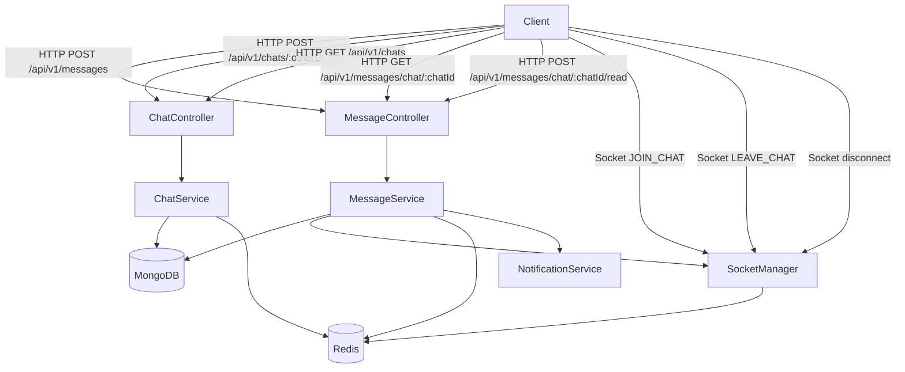

# Design Document: Chat Message System Refactor

## Overview

This refactor replaces the existing chat and message modules with a clean, industry-standard 1-on-1 messaging system. The current implementation has several structural problems: the Chat schema carries a `status` boolean that is never meaningfully used, the Message schema has `deliveredTo`, `status`, and `editedAt` fields that add complexity without value, the chat list query issues one `Message.findOne` per chat (N+1), unread counts fall back to a MongoDB `countDocuments` per chat, socket emission uses `global.io` with no type safety, and auto-populate hooks on the Message model make query behavior unpredictable.

The refactor addresses all of these without adding new user-facing features. The result is a system that:

- Serves the chat list in a single MongoDB query plus one batched Redis read
- Tracks unread counts exclusively in Redis with a safe fallback to `0`
- Replaces `global.io` with a typed `SocketManager` singleton
- Tracks each user's currently-open chat in Redis so the send path can decide between a socket event and a push notification without an extra DB round-trip
- Removes all auto-populate hooks; every `.populate()` call is explicit at the call site

The tech stack is unchanged: Node.js, TypeScript, Express, Mongoose (MongoDB), Socket.io v4, Redis, and Firebase Admin for push notifications.

---

## Architecture

### High-Level Flow



### Component Responsibilities

| Component | Responsibility |
|---|---|
| `ChatService` | `createOrGet`, `getList` — Chat CRUD and list assembly |
| `MessageService` | `send`, `getHistory`, `markRead` — Message lifecycle |
| `SocketManager` | Typed singleton wrapping `Server`; active-chat tracking in Redis |
| `RedisClient` | Shared ioredis client; used for unread counts and active-chat keys |
| `NotificationService` | Push notification dispatch with 60-second deduplication window |

### Key Design Decisions

**Denormalized `lastMessage` on Chat** — Rather than querying the latest message per chat at read time, the `send` path atomically updates `Chat.lastMessage` when a message is saved. This converts the N+1 pattern into a single `Chat.find()` for the list endpoint.

**Redis-only unread counts** — Unread counts are stored exclusively in Redis under `unread:{chatId}:{userId}`. There is no MongoDB fallback query. If Redis is unavailable, the service returns `0` and logs the error. This is acceptable because unread counts are a display hint, not authoritative data.

**Active-chat tracking in Redis** — When a client emits `JOIN_CHAT`, the socket handler writes `active:{userId}:chat = chatId` with a 3600-second TTL. The `send` path reads this key to decide whether to emit `CHAT_UPDATED` to the receiver's user room or send a push notification. This avoids a DB query on every message send.

**Typed `SocketManager` singleton** — `global.io` is replaced with a module-level singleton that exposes a `getIO()` function. This eliminates `@ts-ignore` casts and makes the dependency explicit.

**Explicit population** — All `pre('find')` and `pre('findOne')` hooks are removed from the Message model. Every query that needs sender data calls `.populate('sender', '_id name profilePicture')` explicitly.

---

## Components and Interfaces

### SocketManager (`src/helpers/socketManager.ts`)

Replaces the `global.io` pattern. Initialized once in `server.ts` after the Socket.io server is created.

```typescript
// src/helpers/socketManager.ts
import { Server } from 'socket.io';

let _io: Server | null = null;

export const SocketManager = {
  init(io: Server): void {
    _io = io;
  },

  getIO(): Server {
    if (!_io) {
      throw new Error('SocketManager: Socket.io server has not been initialized');
    }
    return _io;
  },
};
```

**Active-chat Redis keys** managed by `SocketManager`:

| Key pattern | Value | TTL |
|---|---|---|
| `active:{userId}:chat` | `chatId` string | 3600 s |

The socket handler in `socketHelper.ts` calls Redis directly for these keys. The `JOIN_CHAT` handler writes the key; `LEAVE_CHAT` and `disconnect` delete it.

### RedisClient (`src/shared/redisClient.ts`)

A shared ioredis instance used by all modules. Errors are caught at the call site; the client itself does not throw on connection loss (ioredis reconnects automatically).

```typescript
// src/shared/redisClient.ts
import Redis from 'ioredis';
import config from '../config';

export const redisClient = new Redis(config.redis_url as string);
```

> **Note:** The existing `unreadHelper.ts` uses `node-cache` (in-memory). The refactor replaces this with ioredis so unread counts survive process restarts and work correctly in multi-process deployments. The `presenceHelper.ts` (online/offline tracking) continues to use `node-cache` as it is intentionally ephemeral.

### ChatService (`src/app/modules/chat/chat.service.ts`)

```typescript
interface ChatService {
  createOrGet(userId: string, otherUserId: string): Promise<IChat>;
  getList(userId: string, search?: string): Promise<IChatListItem[]>;
}

interface IChatListItem {
  _id: Types.ObjectId;
  participants: IUserSummary[];   // populated: _id, name, image, role
  lastMessage: ILastMessage | null;
  unreadCount: number;
  createdAt: Date;
  updatedAt: Date;
}
```

### MessageService (`src/app/modules/message/message.service.ts`)

```typescript
interface MessageService {
  send(chatId: string, senderId: string, payload: ISendPayload): Promise<IMessage>;
  getHistory(chatId: string, userId: string, cursor?: string, limit?: number): Promise<IHistoryResult>;
  markRead(chatId: string, userId: string): Promise<IMarkReadResult>;
}

interface ISendPayload {
  text?: string;
  type: 'text' | 'image' | 'media' | 'doc' | 'mixed';
  attachments?: IMessageAttachment[];
}

interface IHistoryResult {
  messages: IMessage[];
  pagination: {
    total: number;
    limit: number;
    hasNextPage: boolean;
    nextCursor: string | null;
  };
}

interface IMarkReadResult {
  modifiedCount: number;
  updatedIds: string[];
}
```

### Socket Events

| Event | Direction | Payload | Trigger |
|---|---|---|---|
| `JOIN_CHAT` | Client → Server | `{ chatId: string }` | User opens a chat |
| `LEAVE_CHAT` | Client → Server | `{ chatId: string }` | User closes a chat |
| `MESSAGE_SENT` | Server → Chat Room | `{ message: IMessage }` | Message saved |
| `CHAT_UPDATED` | Server → User Room | `{ lastMessage, unreadCount }` | Message sent, receiver online but in different chat |
| `MESSAGES_READ` | Server → Chat Room | `{ chatId, userId, updatedIds }` | `markRead` completes with ≥1 update |

---

## Data Models

### Chat Schema (refactored)

```typescript
// chat.interface.ts
export type ILastMessage = {
  text: string;       // capped at 2000 chars
  sender: Types.ObjectId;
  createdAt: Date;
};

export type IChat = {
  participants: Types.ObjectId[];   // exactly 2
  lastMessage: ILastMessage | null;
  createdAt: Date;
  updatedAt: Date;
};
```

```typescript
// chat.model.ts
const lastMessageSchema = new Schema<ILastMessage>(
  {
    text:      { type: String, maxlength: 2000 },
    sender:    { type: Schema.Types.ObjectId, ref: 'User', required: true },
    createdAt: { type: Date, required: true },
  },
  { _id: false }
);

const chatSchema = new Schema<IChat, ChatModel>(
  {
    participants: {
      type: [{ type: Schema.Types.ObjectId, ref: 'User' }],
      validate: { validator: (v: any[]) => v.length === 2, message: 'Chat must have exactly 2 participants' },
    },
    lastMessage: { type: lastMessageSchema, default: null },
  },
  { timestamps: true }
);

chatSchema.index({ participants: 1 });
```

**Removed fields:** `status: Boolean`

**Added fields:** `lastMessage` sub-document

### Message Schema (refactored)

```typescript
// message.interface.ts
export type IMessage = {
  chatId:      Types.ObjectId;
  sender:      Types.ObjectId;
  text?:       string;           // max 4000 chars; required when type === 'text'
  type:        'text' | 'image' | 'media' | 'doc' | 'mixed';
  attachments: IMessageAttachment[];  // max 10 elements
  readBy:      Types.ObjectId[];      // max 1000 elements
  createdAt:   Date;
  updatedAt:   Date;
};
```

```typescript
// message.model.ts  (hooks section — removed)
// REMOVED: messageSchema.pre('find', ...)
// REMOVED: messageSchema.pre('findOne', ...)

messageSchema.index({ chatId: 1, createdAt: -1 });
```

**Removed fields:** `deliveredTo`, `status` (`sent|delivered|seen`), `editedAt`

**Removed hooks:** `pre('find')`, `pre('findOne')` auto-populate

**Validation added:** When `type === 'text'`, `text` must be present and non-empty (Mongoose custom validator).

### Redis Key Schema

| Key | Type | Value | TTL | Owner |
|---|---|---|---|---|
| `unread:{chatId}:{userId}` | String (integer) | Unread count | None (persistent) | MessageService / ChatService |
| `active:{userId}:chat` | String | chatId | 3600 s | SocketManager / socketHelper |
| `notif:dedup:{chatId}:{userId}` | String | `"1"` | 60 s | MessageService |

---

## Correctness Properties

*A property is a characteristic or behavior that should hold true across all valid executions of a system — essentially, a formal statement about what the system should do. Properties serve as the bridge between human-readable specifications and machine-verifiable correctness guarantees.*

### Property 1: createOrGet is idempotent

*For any* two distinct valid user IDs, calling `createOrGet(A, B)` any number of times SHALL always return a document with the same `_id` — no duplicate Chat documents are created regardless of how many times the call is repeated.

**Validates: Requirements 3.1, 3.2**

---

### Property 2: createOrGet is commutative

*For any* two distinct valid user IDs A and B, `createOrGet(A, B)` and `createOrGet(B, A)` SHALL return the same Chat document (same `_id`), regardless of the order in which the participant IDs are passed.

**Validates: Requirements 3.1**

---

### Property 3: Invalid ObjectId inputs are rejected before any database query

*For any* string that is not a valid MongoDB ObjectId format, every service method that accepts a `chatId`, `userId`, or `otherUserId` parameter SHALL throw a 400 Bad Request error without executing any database query.

**Validates: Requirements 3.5, 4.7, 5.1 (ObjectId path), 6.6, 6.7, 7.6, 7.7, 10.4, 10.5**

---

### Property 4: send rejects all forms of empty content

*For any* message payload where `text` is absent, empty, or whitespace-only AND `attachments` is an empty array, `send` SHALL throw a 400 error and SHALL NOT persist any document to the database. Additionally, for any `text` string exceeding 10,000 characters or any `attachments` array with more than 10 elements, `send` SHALL throw a 400 error.

**Validates: Requirements 5.3, 5.4, 5.5**

---

### Property 5: send updates Chat.lastMessage and increments receiver unread count

*For any* valid message successfully saved by `send`, the Chat document's `lastMessage` sub-document SHALL reflect the saved message's `text`, `sender`, and `createdAt`, and the receiver's unread count in Redis SHALL be incremented by exactly 1.

**Validates: Requirements 5.11, 9.1, 1.3**

---

### Property 6: send notification routing follows active-chat state

*For any* successfully saved message, the notification routing SHALL satisfy: if the receiver's `active:{userId}:chat` Redis key equals `chatId`, no push notification is sent and no `CHAT_UPDATED` event is emitted; if the key exists but holds a different chatId, `CHAT_UPDATED` is emitted to the receiver's user room; if the key is absent (receiver offline), at most one push notification is dispatched within any 60-second window per chat per receiver.

**Validates: Requirements 5.8, 5.9, 5.10**

---

### Property 7: send side-effect failures do not suppress the saved message

*For any* valid message, when any combination of socket emission, Redis unread increment, or push notification dispatch throws an error, `send` SHALL still return the saved Message document and SHALL NOT propagate the side-effect error to the caller.

**Validates: Requirements 5.12, 10.1**

---

### Property 8: getHistory cursor pagination is consistent and complete

*For any* chatId with N messages, paginating through all pages using the `nextCursor` from each response SHALL yield every message exactly once with no duplicates and no gaps, in ascending `createdAt` order. The `hasNextPage` flag SHALL be `true` if and only if messages remain after the current page's `nextCursor`.

**Validates: Requirements 6.1, 6.2, 6.3, 6.5**

---

### Property 9: getHistory limit is always clamped to the valid range

*For any* `limit` value provided to `getHistory` — including values below 1, above 100, or non-numeric — the number of messages returned SHALL never exceed 100 and SHALL default to 20 when not provided.

**Validates: Requirements 6.2**

---

### Property 10: markRead only adds userId to readBy for messages sent by others

*For any* chat and userId, after `markRead(chatId, userId)` completes, every Message in that chat where `sender !== userId` and that previously did not contain `userId` in `readBy` SHALL now contain `userId` in `readBy`; messages where `sender === userId` SHALL NOT have `userId` added to `readBy`.

**Validates: Requirements 7.1, 7.8**

---

### Property 11: markRead resets unread count to zero

*For any* chatId and userId, after `markRead(chatId, userId)` completes with at least one updated message, the Redis key `unread:{chatId}:{userId}` SHALL be set to `0`, regardless of what value it held before.

**Validates: Requirements 7.4, 9.2**

---

### Property 12: getList unread counts are always non-negative integers

*For any* userId, every `unreadCount` value in the result of `getList` SHALL be a non-negative integer (≥ 0). When Redis is unavailable or throws any error, all unread counts SHALL be `0` and the error SHALL be logged without propagating to the caller.

**Validates: Requirements 4.3, 4.4, 9.3, 9.5, 10.2**

---

## Error Handling

### Critical vs. Non-Critical Paths

The refactor draws a hard line between errors that must propagate and errors that must be swallowed-and-logged.

**Critical (re-throw to caller):**
- `Message.create()` failure
- `Chat.findOneAndUpdate()` failure when updating `lastMessage`
- `Chat.findOne()` / `Chat.exists()` failure during participant validation
- `Message.find()` / `Message.updateMany()` failure in `markRead`

**Non-critical (log with `errorLogger`, return safe fallback):**
- Redis `INCR` / `SET` for unread count (fallback: operation silently skipped; count may be stale)
- Redis `MGET` for batch unread counts in `getList` (fallback: all counts return `0`)
- Redis `SET` / `DEL` for active-chat tracking (fallback: notification logic falls back to sending push)
- Push notification dispatch (fallback: notification not sent; message still returned)
- Socket emission (fallback: client does not receive real-time event; message still returned)

**Rule:** Non-critical catch blocks MUST call `errorLogger.error(...)` before continuing. Empty `catch {}` blocks are forbidden.

### Input Validation

All service methods validate ObjectId format before executing any database query:

```typescript
// Shared guard used in all service methods
function assertObjectId(value: string, label: string): void {
  if (!mongoose.Types.ObjectId.isValid(value)) {
    throw new ApiError(StatusCodes.BAD_REQUEST, `Invalid ${label}`);
  }
}
```

### Error Response Mapping

| Condition | HTTP Status | Message |
|---|---|---|
| Invalid ObjectId format | 400 | `Invalid {field}` |
| `userId === otherUserId` | 400 | `Cannot create a chat with yourself` |
| `otherUserId` not found | 404 | `User not found` |
| Chat not found | 404 | `Chat not found` |
| Sender not a participant | 403 | `You are not a participant of this chat` |
| Empty message content | 400 | `Message must contain text or at least one attachment` |
| Text exceeds 10,000 chars | 400 | `Message text exceeds maximum length` |
| More than 10 attachments | 400 | `Attachments cannot exceed 10 items` |

---

## Testing Strategy

### Dual Testing Approach

Unit tests cover specific examples, edge cases, and error conditions. Property-based tests verify universal properties across generated inputs. Both are necessary for comprehensive coverage.

### Property-Based Testing

The project uses **Vitest** (already configured in `package.json`) with **`@fast-check/vitest`** for property-based testing.

Each property test runs a minimum of **100 iterations**. Tests are tagged with a comment referencing the design property:

```typescript
// Feature: chat-message-system-refactor, Property 1: createOrGet is idempotent
it.prop([fc.string(), fc.string()])('createOrGet idempotency', async (a, b) => { ... });
```

**Properties to implement as PBT:**

| Property | Test file | Library |
|---|---|---|
| P1: createOrGet idempotency | `chat.service.spec.ts` | fast-check |
| P2: createOrGet commutativity | `chat.service.spec.ts` | fast-check |
| P3: Invalid ObjectId inputs rejected | `chat.service.spec.ts`, `message.service.spec.ts` | fast-check |
| P4: send rejects all forms of empty content | `message.service.spec.ts` | fast-check |
| P5: send updates lastMessage and unread count | `message.service.spec.ts` | fast-check |
| P6: send notification routing | `message.service.spec.ts` | fast-check |
| P7: send side-effect failures don't suppress message | `message.service.spec.ts` | fast-check |
| P8: getHistory cursor pagination consistency | `message.service.spec.ts` | fast-check |
| P9: getHistory limit clamping | `message.service.spec.ts` | fast-check |
| P10: markRead only affects others' messages | `message.service.spec.ts` | fast-check |
| P11: markRead resets unread count to zero | `message.service.spec.ts` | fast-check |
| P12: getList unread counts non-negative | `chat.service.spec.ts` | fast-check |

### Unit Tests

Unit tests cover:
- `createOrGet` with `userId === otherUserId` → 400
- `createOrGet` with non-existent `otherUserId` → 404
- `send` with non-existent `chatId` → 404
- `send` with sender not in participants → 403
- `getHistory` with invalid ObjectId → 400
- `markRead` with user not a participant → 403
- `markRead` with no unread messages → `{ modifiedCount: 0, updatedIds: [] }`, no socket event
- `SocketManager.getIO()` before `init()` → throws
- `JOIN_CHAT` with empty `chatId` → no Redis write

### Integration Tests

- Full `send` → `getHistory` round-trip with a real MongoDB (using `mongodb-memory-server`, already in devDependencies)
- `markRead` resets Redis unread count to `0`
- `getList` returns `unreadCount: 0` when Redis is unavailable (mock ioredis to throw)

### Test Infrastructure

- **MongoDB:** `mongodb-memory-server` (already installed)
- **Redis:** mock ioredis with `ioredis-mock` or manual jest/vitest mock
- **Socket.io:** `socket.io-client` for integration tests; mock `SocketManager.getIO()` in unit tests
- **Test runner:** Vitest (`npm run test:run`)
