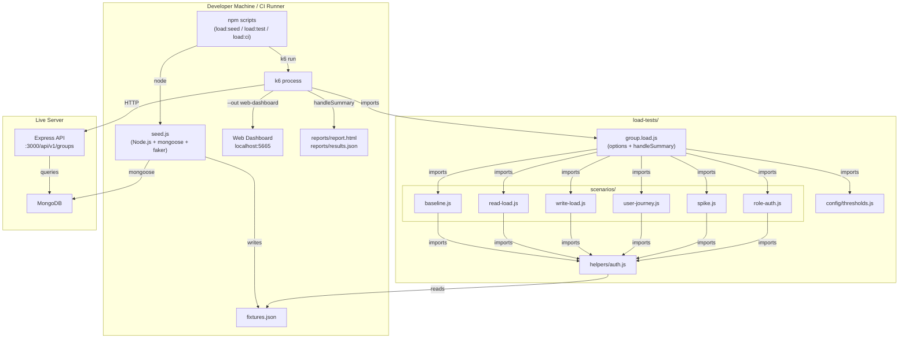

# Design Document: group-load-testing

## Overview

This document describes the technical design for a k6-based load testing suite targeting the Group API of the Educoin backend. The suite exercises all 18 Group API endpoints across six named scenarios — baseline, read-load, write-load, user-journey, spike, and role-auth — using pre-seeded fixture data, a real-time web dashboard, and an auto-generated HTML report.

k6 is an external OS process that sends real HTTP requests over the network to a live server. It is not a unit test framework and does not run inside Node.js. The seed script (`helpers/seed.js`) is a plain Node.js script that populates MongoDB and writes `fixtures.json`; k6 reads that file at startup via `SharedArray`.

### Key Design Decisions

- **External tool, real network**: k6 measures actual end-to-end latency including middleware, DB queries, and serialization. No mocking.
- **Fixture-driven**: All test data is created once by `seed.js` before the run. k6 scenarios are read-only consumers of `fixtures.json` — they do not create users or groups dynamically.
- **Idempotent seeding**: The seed script deletes all documents whose email matches the prefix `loadtest-` before inserting, making it safe to re-run.
- **Threshold-as-contract**: All thresholds live in `config/thresholds.js` and are imported into `group.load.js`. A breach causes k6 exit code 99, which fails CI automatically.
- **SKIP_LOAD_TESTS guard**: The `default` function in `group.load.js` checks `__ENV.SKIP_LOAD_TESTS === 'true'` and returns immediately, enabling CI environments without a live server to skip gracefully.

---

## Architecture

### Component Diagram



### Execution Flow

```
1. npm run load:seed
   └─ seed.js connects to MongoDB
   └─ deletes all docs with email prefix "loadtest-"
   └─ creates: 1 SUPER_ADMIN, 10 BROTHER users, 10 SISTER users,
               2 BROTHER groups, 2 SISTER groups, 5 posts per group
   └─ signs JWT for each user (30d expiry)
   └─ writes fixtures.json

2. npm run load:test  (or load:ci)
   └─ k6 starts, loads group.load.js
   └─ SharedArray reads fixtures.json once (shared across all VUs)
   └─ Checks SKIP_LOAD_TESTS — exits 0 if set
   └─ Runs 6 scenarios (may overlap based on startTime offsets)
   └─ Each scenario imports its module, executes VU logic
   └─ k6 collects metrics, evaluates thresholds at end
   └─ handleSummary writes report.html + stdout summary
   └─ Exits 0 (all pass) or 99 (threshold breach)
```

---

## Components and Interfaces

### File Structure

```
load-tests/
├── config/
│   └── thresholds.js          # Exports THRESHOLDS object
├── helpers/
│   ├── seed.js                # Node.js seed script (mongoose + faker)
│   └── auth.js                # Token helpers for k6 scenarios
├── scenarios/
│   ├── baseline.js            # 1 VU, 1 iteration, 7 endpoints
│   ├── read-load.js           # 50 VUs, 30s, read operations
│   ├── write-load.js          # 20 VUs, 30s, write operations
│   ├── user-journey.js        # 10 VUs, 30s, full 7-step flow
│   ├── spike.js               # ramping-vus: 5→50→5
│   └── role-auth.js           # 20 VUs, 10s, 403 enforcement
├── reports/                   # .gitignore'd — generated output
│   ├── report.html
│   └── results.json
├── fixtures.json              # Written by seed.js, read by k6
└── group.load.js              # Main k6 entry point
```

### Interface: fixtures.json

```json
{
  "adminUser": {
    "id": "<ObjectId>",
    "email": "loadtest-admin@test.com",
    "token": "<JWT>"
  },
  "brotherUsers": [
    { "id": "<ObjectId>", "email": "loadtest-brother-0@test.com", "token": "<JWT>" }
  ],
  "sisterUsers": [
    { "id": "<ObjectId>", "email": "loadtest-sister-0@test.com", "token": "<JWT>" }
  ],
  "brotherGroups": [
    { "id": "<ObjectId>", "name": "Load Test Brothers 0" }
  ],
  "sisterGroups": [
    { "id": "<ObjectId>", "name": "Load Test Sisters 0" }
  ],
  "posts": [
    { "id": "<ObjectId>", "groupId": "<ObjectId>" }
  ]
}
```

Required keys: `adminUser`, `brotherUsers` (≥10), `sisterUsers` (≥10), `brotherGroups` (≥2), `sisterGroups` (≥2), `posts` (≥10, 5 per group).

### Interface: config/thresholds.js

```js
// Exported shape — consumed by group.load.js via spread
export const THRESHOLDS = {
  'http_req_duration{scenario:"baseline"}':        ['p(95)<500'],
  'http_req_duration{scenario:"read_load"}':       ['p(95)<1000'],
  'http_req_failed{scenario:"read_load"}':         ['rate<0.01'],
  'http_req_duration{scenario:"write_load"}':      ['p(95)<2000'],
  'http_req_failed{scenario:"write_load"}':        ['rate<0.05'],
  'http_req_duration{scenario:"user_journey"}':    ['p(95)<3000'],
  'http_req_failed{scenario:"spike"}':             ['rate<0.05'],
  'http_req_failed{scenario:"role_auth"}':         ['rate<0.001'],
  'checks{scenario:"role_auth"}':                  ['rate==1.0'],
};
```

### Interface: helpers/auth.js

```js
// getToken(fixtures, role, vuIndex) → string
// Returns the JWT for the VU at the given index.
// role: 'brother' | 'sister' | 'admin'
// vuIndex: used for round-robin selection from the pool
export function getToken(fixtures, role, vuIndex) { ... }

// getAuthHeaders(fixtures, role, vuIndex) → { Authorization: "Bearer <token>" }
export function getAuthHeaders(fixtures, role, vuIndex) { ... }

// getUser(fixtures, role, vuIndex) → { id, email, token }
export function getUser(fixtures, role, vuIndex) { ... }
```

---

## Data Models

### Fixture Generation (seed.js)

The seed script uses `@faker-js/faker` (already in devDependencies) and `mongoose` (already in dependencies). It signs JWTs directly using `jsonwebtoken` with the same `JWT_SECRET` and `JWT_EXPIRE_IN` env vars the server uses.

**User document shape created by seed:**

```js
{
  name: faker.person.fullName(),
  role: 'BROTHER' | 'SISTER' | 'SUPER_ADMIN',
  email: `loadtest-${role}-${index}@test.com`,   // prefix enables idempotent cleanup
  password: bcrypt.hashSync('LoadTest123!', 10),
  status: 'ACTIVE',
  isVerified: true,
  dateOfBirth: faker.date.birthdate({ min: 18, max: 40, mode: 'age' }),
  revertDate: new Date(),                         // required for BROTHER/SISTER
  profileImage: '/default-avatar.svg',
  verificationImage: 'https://placeholder.com/verification.jpg',
  verificationVideo: 'https://placeholder.com/verification.mp4',
  tokenVersion: 0,
}
```

**JWT payload shape** (matches what `jwtHelper.createToken` produces and `auth` middleware reads):

```js
{
  id: user._id.toString(),
  role: user.role,
  email: user.email,
  tokenVersion: 0,
}
// signed with JWT_SECRET, expires in JWT_EXPIRE_IN (or '30d' fallback)
```

**Group document shape:**

```js
{
  name: `Load Test ${userType} Group ${index}`,
  description: faker.lorem.sentence(),
  userType: 'BROTHER' | 'SISTER',
  category: 'load-testing',
  memberCount: 0,
}
```

**Post document shape** (inserted directly into GroupPost collection):

```js
{
  groupId: group._id,
  userId: adminUser._id,
  content: faker.lorem.paragraph(),
  attachments: [],
  likesCount: 0,
  commentsCount: 0,
  isPinned: false,
}
```

### SharedArray Loading in k6

```js
// In group.load.js (and each scenario module)
import { SharedArray } from 'k6/data';

const fixtures = new SharedArray('fixtures', function () {
  return [JSON.parse(open('../fixtures.json'))];
})[0];
```

`SharedArray` deserializes once and shares the read-only data across all VUs, avoiding per-VU memory duplication.

### Custom Metrics

```js
// Defined in group.load.js, imported by scenarios that need them
import { Counter } from 'k6/metrics';

export const readCheckFailures  = new Counter('read_check_failures');
export const authBypassCount    = new Counter('auth_bypass_count');
```

---

## Pseudocode Per File

### load-tests/helpers/seed.js

```
REQUIRE dotenv, mongoose, bcrypt, jsonwebtoken, fs, path, faker

LOAD .env from project root

CONST MONGODB_URI = process.env.MONGODB_URI || process.env.DATABASE_URL
IF NOT MONGODB_URI:
  console.error("MONGODB_URI is not set")
  process.exit(1)

CONST JWT_SECRET   = process.env.JWT_SECRET
CONST JWT_EXPIRE   = process.env.JWT_EXPIRE_IN || '30d'
CONST EMAIL_PREFIX = 'loadtest-'

FUNCTION signToken(user):
  RETURN jwt.sign({ id: user._id, role: user.role, email: user.email, tokenVersion: 0 },
                  JWT_SECRET, { expiresIn: JWT_EXPIRE })

ASYNC FUNCTION seed():
  TRY:
    await mongoose.connect(MONGODB_URI)
    console.log("Connected to MongoDB")

    // Idempotent cleanup — delete all prior load-test documents
    await User.deleteMany({ email: { $regex: '^' + EMAIL_PREFIX } })
    await Group.deleteMany({ category: 'load-testing' })
    // Posts/members/likes/comments cascade via groupId cleanup
    await GroupPost.deleteMany({ content: { $regex: 'load-test-seed' } })
    await GroupMember.deleteMany({})  // safe: only load-test groups existed

    // Create SUPER_ADMIN
    adminUser = await User.create({ ...adminShape, email: 'loadtest-admin@test.com' })

    // Create 10 BROTHER users
    brotherUsers = await User.insertMany([...10 brotherShapes])

    // Create 10 SISTER users
    sisterUsers = await User.insertMany([...10 sisterShapes])

    // Create 2 BROTHER groups
    brotherGroups = await Group.insertMany([...2 brotherGroupShapes])

    // Create 2 SISTER groups
    sisterGroups = await Group.insertMany([...2 sisterGroupShapes])

    // Create 5 posts per group (20 total)
    posts = []
    FOR EACH group IN [...brotherGroups, ...sisterGroups]:
      FOR i IN 0..4:
        post = await GroupPost.create({ groupId: group._id, userId: adminUser._id,
                                        content: 'load-test-seed ' + faker.lorem.sentence() })
        posts.push({ id: post._id.toString(), groupId: group._id.toString() })

    // Build fixtures object
    fixtures = {
      adminUser:    { id, email, token: signToken(adminUser) },
      brotherUsers: brotherUsers.map(u => ({ id, email, token: signToken(u) })),
      sisterUsers:  sisterUsers.map(u => ({ id, email, token: signToken(u) })),
      brotherGroups: brotherGroups.map(g => ({ id, name })),
      sisterGroups:  sisterGroups.map(g => ({ id, name })),
      posts,
    }

    // Write fixtures.json
    fs.writeFileSync(FIXTURES_PATH, JSON.stringify(fixtures, null, 2))
    console.log("fixtures.json written with", posts.length, "posts")

    await mongoose.disconnect()
    process.exit(0)

  CATCH error:
    console.error("Seed failed:", error.message)
    await mongoose.disconnect().catch(() => {})
    process.exit(1)

seed()
```

### load-tests/helpers/auth.js

```js
// Pure helper — no k6 imports, works in both k6 and Node contexts

export function getUser(fixtures, role, vuIndex) {
  const pool = role === 'admin'   ? [fixtures.adminUser]
             : role === 'brother' ? fixtures.brotherUsers
             :                      fixtures.sisterUsers;
  return pool[vuIndex % pool.length];
}

export function getToken(fixtures, role, vuIndex) {
  return getUser(fixtures, role, vuIndex).token;
}

export function getAuthHeaders(fixtures, role, vuIndex) {
  return { Authorization: `Bearer ${getToken(fixtures, role, vuIndex)}` };
}
```

### load-tests/config/thresholds.js

```js
export const THRESHOLDS = {
  'http_req_duration{scenario:"baseline"}':     ['p(95)<500'],
  'http_req_duration{scenario:"read_load"}':    ['p(95)<1000'],
  'http_req_failed{scenario:"read_load"}':      ['rate<0.01'],
  'http_req_duration{scenario:"write_load"}':   ['p(95)<2000'],
  'http_req_failed{scenario:"write_load"}':     ['rate<0.05'],
  'http_req_duration{scenario:"user_journey"}': ['p(95)<3000'],
  'http_req_failed{scenario:"spike"}':          ['rate<0.05'],
  'http_req_failed{scenario:"role_auth"}':      ['rate<0.001'],
  'checks{scenario:"role_auth"}':               ['rate==1.0'],
};
```

### load-tests/group.load.js

```js
import { SharedArray } from 'k6/data';
import { htmlReport } from 'https://raw.githubusercontent.com/benc-uk/k6-reporter/main/dist/bundle.js';
import { textSummary } from 'https://jslib.k6.io/k6-summary/0.0.1/index.js';
import { Counter } from 'k6/metrics';
import { THRESHOLDS } from './config/thresholds.js';
import { baselineScenario } from './scenarios/baseline.js';
import { readLoadScenario } from './scenarios/read-load.js';
import { writeLoadScenario } from './scenarios/write-load.js';
import { userJourneyScenario } from './scenarios/user-journey.js';
import { spikeScenario } from './scenarios/spike.js';
import { roleAuthScenario } from './scenarios/role-auth.js';

export const readCheckFailures = new Counter('read_check_failures');
export const authBypassCount   = new Counter('auth_bypass_count');

const fixtures = new SharedArray('fixtures', function () {
  return [JSON.parse(open('./fixtures.json'))];
})[0];

export const options = {
  scenarios: {
    baseline:     { ...baselineScenario,     startTime: '0s'  },
    read_load:    { ...readLoadScenario,     startTime: '5s'  },
    write_load:   { ...writeLoadScenario,    startTime: '5s'  },
    user_journey: { ...userJourneyScenario,  startTime: '5s'  },
    spike:        { ...spikeScenario,        startTime: '40s' },
    role_auth:    { ...roleAuthScenario,     startTime: '5s'  },
  },
  thresholds: { ...THRESHOLDS },
};

export default function () {
  if (__ENV.SKIP_LOAD_TESTS === 'true') {
    return;
  }
  // Each scenario's exec function is defined in its own module.
  // k6 routes VUs to the correct exec function via the scenario config.
}

export function handleSummary(data) {
  return {
    'load-tests/reports/report.html': htmlReport(data),
    stdout: textSummary(data, { indent: ' ', enableColors: true }),
  };
}
```

### load-tests/scenarios/baseline.js

```js
import http from 'k6/http';
import { check, group } from 'k6';
import { SharedArray } from 'k6/data';
import { getAuthHeaders } from '../helpers/auth.js';

const fixtures = new SharedArray('fixtures', () => [JSON.parse(open('../fixtures.json'))])[0];
const BASE_URL = __ENV.BASE_URL || 'http://localhost:3000';

export const baselineScenario = {
  executor: 'per-vu-iterations',
  vus: 1,
  iterations: 1,
  exec: 'runBaseline',
};

export function runBaseline() {
  const headers = getAuthHeaders(fixtures, 'brother', 0);
  const groupId = fixtures.brotherGroups[0].id;
  const postId  = fixtures.posts[0].id;

  const endpoints = [
    { tag: 'GET /groups',              fn: () => http.get(`${BASE_URL}/api/v1/groups`, { headers, tags: { name: 'GET /groups' } }) },
    { tag: 'GET /groups/:id',          fn: () => http.get(`${BASE_URL}/api/v1/groups/${groupId}`, { headers, tags: { name: 'GET /groups/:id' } }) },
    { tag: 'POST /groups/:id/join',    fn: () => http.post(`${BASE_URL}/api/v1/groups/${groupId}/join`, null, { headers, tags: { name: 'POST /groups/:id/join' } }) },
    { tag: 'GET /groups/:id/posts',    fn: () => http.get(`${BASE_URL}/api/v1/groups/${groupId}/posts`, { headers, tags: { name: 'GET /groups/:id/posts' } }) },
    { tag: 'POST /groups/:id/posts',   fn: () => http.post(`${BASE_URL}/api/v1/groups/${groupId}/posts`, JSON.stringify({ content: 'baseline test post' }), { headers: { ...headers, 'Content-Type': 'application/json' }, tags: { name: 'POST /groups/:id/posts' } }) },
    { tag: 'POST /posts/:id/like',     fn: () => http.post(`${BASE_URL}/api/v1/groups/posts/${postId}/like`, null, { headers, tags: { name: 'POST /posts/:id/like' } }) },
    { tag: 'POST /posts/:id/comments', fn: () => http.post(`${BASE_URL}/api/v1/groups/posts/${postId}/comments`, JSON.stringify({ comment: 'baseline comment' }), { headers: { ...headers, 'Content-Type': 'application/json' }, tags: { name: 'POST /posts/:id/comments' } }) },
  ];

  for (const ep of endpoints) {
    const res = ep.fn();
    check(res, { [`${ep.tag} status 2xx`]: (r) => r.status >= 200 && r.status < 300 });
    console.log(`${ep.tag} → ${res.status} | p50 proxy: ${res.timings.duration}ms`);
  }
}
```

### load-tests/scenarios/read-load.js

```js
import http from 'k6/http';
import { check, sleep } from 'k6';
import { SharedArray } from 'k6/data';
import { getAuthHeaders } from '../helpers/auth.js';
import { readCheckFailures } from '../group.load.js';

const fixtures = new SharedArray('fixtures', () => [JSON.parse(open('../fixtures.json'))])[0];
const BASE_URL = __ENV.BASE_URL || 'http://localhost:3000';

export const readLoadScenario = {
  executor: 'constant-vus',
  vus: 50,
  duration: '30s',
  exec: 'runReadLoad',
};

export function runReadLoad() {
  const vuIndex = __VU - 1;
  const headers = getAuthHeaders(fixtures, 'brother', vuIndex);
  // Distribute across available groups to avoid hotspotting
  const group   = fixtures.brotherGroups[vuIndex % fixtures.brotherGroups.length];
  const post    = fixtures.posts[vuIndex % fixtures.posts.length];

  const checks = {
    'GET /groups 200':           http.get(`${BASE_URL}/api/v1/groups`, { headers, tags: { name: 'GET /groups' } }),
    'GET /groups/:id 200':       http.get(`${BASE_URL}/api/v1/groups/${group.id}`, { headers, tags: { name: 'GET /groups/:id' } }),
    'GET /groups/:id/posts 200': http.get(`${BASE_URL}/api/v1/groups/${group.id}/posts`, { headers, tags: { name: 'GET /groups/:id/posts' } }),
    'GET /posts/:id/comments 200': http.get(`${BASE_URL}/api/v1/groups/posts/${post.id}/comments`, { headers, tags: { name: 'GET /posts/:id/comments' } }),
  };

  for (const [label, res] of Object.entries(checks)) {
    const ok = check(res, { [label]: (r) => r.status === 200 });
    if (!ok) readCheckFailures.add(1);
  }

  sleep(1);
}
```

### load-tests/scenarios/write-load.js

```js
import http from 'k6/http';
import { check, sleep } from 'k6';
import { SharedArray } from 'k6/data';
import { getAuthHeaders } from '../helpers/auth.js';

const fixtures = new SharedArray('fixtures', () => [JSON.parse(open('../fixtures.json'))])[0];
const BASE_URL = __ENV.BASE_URL || 'http://localhost:3000';

export const writeLoadScenario = {
  executor: 'constant-vus',
  vus: 20,
  duration: '30s',
  exec: 'runWriteLoad',
};

export function runWriteLoad() {
  const vuIndex = __VU - 1;
  const headers = { ...getAuthHeaders(fixtures, 'brother', vuIndex), 'Content-Type': 'application/json' };
  const group   = fixtures.brotherGroups[vuIndex % fixtures.brotherGroups.length];

  // Step 1: Join group (400 = already member → non-fatal for flow, still a check failure)
  const joinRes = http.post(`${BASE_URL}/api/v1/groups/${group.id}/join`, null,
    { headers, tags: { name: 'POST /groups/:id/join' } });
  const joinOk = joinRes.status >= 200 && joinRes.status < 300;
  const alreadyMember = joinRes.status === 400;
  check(joinRes, { 'join 2xx or 400': (r) => joinOk || alreadyMember });
  if (!joinOk && !alreadyMember) return; // unexpected error — abort iteration

  // Step 2: Create post
  const postRes = http.post(`${BASE_URL}/api/v1/groups/${group.id}/posts`,
    JSON.stringify({ content: `write-load post ${Date.now()}` }),
    { headers, tags: { name: 'POST /groups/:id/posts' } });
  check(postRes, { 'create post 2xx': (r) => r.status >= 200 && r.status < 300 });

  let postId = null;
  try { postId = JSON.parse(postRes.body).data?._id; } catch (_) {}
  if (!postId) postId = fixtures.posts[vuIndex % fixtures.posts.length].id;

  // Step 3: Like post
  const likeRes = http.post(`${BASE_URL}/api/v1/groups/posts/${postId}/like`, null,
    { headers, tags: { name: 'POST /posts/:id/like' } });
  check(likeRes, { 'like 2xx': (r) => r.status >= 200 && r.status < 300 });

  // Step 4: Comment
  const commentRes = http.post(`${BASE_URL}/api/v1/groups/posts/${postId}/comments`,
    JSON.stringify({ comment: `write-load comment ${Date.now()}` }),
    { headers, tags: { name: 'POST /posts/:id/comments' } });
  check(commentRes, { 'comment 2xx': (r) => r.status >= 200 && r.status < 300 });

  sleep(1);
}
```

### load-tests/scenarios/user-journey.js

```js
import http from 'k6/http';
import { check, sleep } from 'k6';
import { SharedArray } from 'k6/data';
import { getAuthHeaders } from '../helpers/auth.js';

const fixtures = new SharedArray('fixtures', () => [JSON.parse(open('../fixtures.json'))])[0];
const BASE_URL = __ENV.BASE_URL || 'http://localhost:3000';

export const userJourneyScenario = {
  executor: 'constant-vus',
  vus: 10,
  duration: '30s',
  exec: 'runUserJourney',
};

export function runUserJourney() {
  const vuIndex = __VU - 1;
  const headers = { ...getAuthHeaders(fixtures, 'brother', vuIndex), 'Content-Type': 'application/json' };
  const group   = fixtures.brotherGroups[vuIndex % fixtures.brotherGroups.length];

  function step(name, res) {
    const ok = check(res, { [`${name} 2xx`]: (r) => r && r.status >= 200 && r.status < 300 });
    if (!ok) {
      const body = res ? res.body : '(no response)';
      console.error(`Journey step failed: ${name} | status=${res?.status} | body=${body}`);
    }
    return ok;
  }

  // Step 1: Browse groups
  const s1 = http.get(`${BASE_URL}/api/v1/groups`, { headers, tags: { name: 'journey:browse' } });
  step('Step1:browse', s1);
  sleep(1);

  // Step 2: View group
  const s2 = http.get(`${BASE_URL}/api/v1/groups/${group.id}`, { headers, tags: { name: 'journey:view-group' } });
  step('Step2:view-group', s2);
  sleep(1);

  // Step 3: Join group
  const s3 = http.post(`${BASE_URL}/api/v1/groups/${group.id}/join`, null, { headers, tags: { name: 'journey:join' } });
  step('Step3:join', s3);
  sleep(1);

  // Step 4: Read feed
  const s4 = http.get(`${BASE_URL}/api/v1/groups/${group.id}/posts`, { headers, tags: { name: 'journey:read-feed' } });
  step('Step4:read-feed', s4);
  sleep(1);

  // Step 5: Create post — capture postId
  const s5 = http.post(`${BASE_URL}/api/v1/groups/${group.id}/posts`,
    JSON.stringify({ content: `journey post ${__VU} ${Date.now()}` }),
    { headers, tags: { name: 'journey:create-post' } });
  step('Step5:create-post', s5);

  let postId = null;
  try { postId = JSON.parse(s5.body).data?._id; } catch (_) {}
  if (!postId) {
    console.error(`Step5: could not extract postId from response, falling back to fixture`);
    postId = fixtures.posts[vuIndex % fixtures.posts.length].id;
  }
  sleep(1);

  // Step 6: Like the post created in Step 5
  const s6 = http.post(`${BASE_URL}/api/v1/groups/posts/${postId}/like`, null,
    { headers, tags: { name: 'journey:like' } });
  step('Step6:like', s6);
  sleep(1);

  // Step 7: Comment on the post created in Step 5
  const s7 = http.post(`${BASE_URL}/api/v1/groups/posts/${postId}/comments`,
    JSON.stringify({ comment: `journey comment ${__VU} ${Date.now()}` }),
    { headers, tags: { name: 'journey:comment' } });
  step('Step7:comment', s7);
  sleep(1);
}
```

### load-tests/scenarios/spike.js

```js
import http from 'k6/http';
import { check } from 'k6';
import { SharedArray } from 'k6/data';
import { getAuthHeaders } from '../helpers/auth.js';

const fixtures = new SharedArray('fixtures', () => [JSON.parse(open('../fixtures.json'))])[0];
const BASE_URL = __ENV.BASE_URL || 'http://localhost:3000';

export const spikeScenario = {
  executor: 'ramping-vus',
  stages: [
    { duration: '5s',  target: 5  },   // ramp_up
    { duration: '10s', target: 50 },   // peak
    { duration: '5s',  target: 5  },   // recovery
  ],
  exec: 'runSpike',
};

// Stage detection: approximate by elapsed time within scenario
// ramp_up: 0–5s, peak: 5–15s, recovery: 15–20s
function getStageTag(elapsed) {
  if (elapsed < 5)  return 'ramp_up';
  if (elapsed < 15) return 'peak';
  return 'recovery';
}

export function runSpike() {
  const vuIndex = __VU - 1;
  const headers = getAuthHeaders(fixtures, 'brother', vuIndex);
  const group   = fixtures.brotherGroups[vuIndex % fixtures.brotherGroups.length];
  const post    = fixtures.posts[vuIndex % fixtures.posts.length];
  const stage   = getStageTag(__ITER);  // approximate; __ITER increments per VU iteration

  const r1 = http.get(`${BASE_URL}/api/v1/groups`,
    { headers, tags: { name: 'GET /groups', stage } });
  check(r1, { 'spike GET /groups 2xx': (r) => r.status >= 200 && r.status < 300 });

  const r2 = http.get(`${BASE_URL}/api/v1/groups/${group.id}/posts`,
    { headers, tags: { name: 'GET /groups/:id/posts', stage } });
  check(r2, { 'spike GET /posts 2xx': (r) => r.status >= 200 && r.status < 300 });

  const r3 = http.post(`${BASE_URL}/api/v1/groups/posts/${post.id}/like`, null,
    { headers, tags: { name: 'POST /posts/:id/like', stage } });
  check(r3, { 'spike like 2xx': (r) => r.status >= 200 && r.status < 300 });
}
```

### load-tests/scenarios/role-auth.js

```js
import http from 'k6/http';
import { check, sleep } from 'k6';
import { SharedArray } from 'k6/data';
import { getAuthHeaders } from '../helpers/auth.js';
import { authBypassCount } from '../group.load.js';

const fixtures = new SharedArray('fixtures', () => [JSON.parse(open('../fixtures.json'))])[0];
const BASE_URL = __ENV.BASE_URL || 'http://localhost:3000';

export const roleAuthScenario = {
  executor: 'constant-vus',
  vus: 20,
  duration: '10s',
  exec: 'runRoleAuth',
};

export function runRoleAuth() {
  const vuIndex = __VU - 1;
  // BROTHER user attempting SUPER_ADMIN-only endpoints
  const brotherHeaders = { ...getAuthHeaders(fixtures, 'brother', vuIndex), 'Content-Type': 'application/json' };
  const sisterHeaders  = { ...getAuthHeaders(fixtures, 'sister',  vuIndex), 'Content-Type': 'application/json' };
  const groupId = fixtures.brotherGroups[0].id;
  const postId  = fixtures.posts[0].id;
  const userId  = fixtures.brotherUsers[0].id;

  const adminEndpoints = [
    { label: 'POST /groups (create)',          res: http.post(`${BASE_URL}/api/v1/groups`, JSON.stringify({ name:'x', description:'x', userType:'BROTHER', category:'x' }), { headers: brotherHeaders, tags: { name: 'auth:create-group' } }) },
    { label: 'PATCH /groups/:id (update)',     res: http.patch(`${BASE_URL}/api/v1/groups/${groupId}`, JSON.stringify({ name:'x' }), { headers: brotherHeaders, tags: { name: 'auth:update-group' } }) },
    { label: 'DELETE /groups/:id (delete)',    res: http.del(`${BASE_URL}/api/v1/groups/${groupId}`, null, { headers: brotherHeaders, tags: { name: 'auth:delete-group' } }) },
    { label: 'DELETE /groups/:id/members/:uid (kick)', res: http.del(`${BASE_URL}/api/v1/groups/${groupId}/members/${userId}`, null, { headers: brotherHeaders, tags: { name: 'auth:kick-member' } }) },
    { label: 'PATCH /posts/:id/pin (pin)',     res: http.patch(`${BASE_URL}/api/v1/groups/posts/${postId}/pin`, null, { headers: brotherHeaders, tags: { name: 'auth:pin-post' } }) },
  ];

  for (const ep of adminEndpoints) {
    const ok = check(ep.res, { [`${ep.label} → 403`]: (r) => r.status === 403 });
    if (!ok) {
      authBypassCount.add(1);
      console.error(`AUTH BYPASS: ${ep.label} returned ${ep.res.status} | body=${ep.res.body}`);
    }
  }

  // SISTER user attempting BROTHER-typed group endpoint
  const sisterOnBrotherGroup = http.get(`${BASE_URL}/api/v1/groups/${groupId}`,
    { headers: sisterHeaders, tags: { name: 'auth:sister-on-brother-group' } });
  check(sisterOnBrotherGroup, { 'sister on brother group → 403': (r) => r.status === 403 });

  sleep(0.5);
}
```

---

## Data Flow

### Seed → k6 Data Flow

```
seed.js
  │
  ├─ mongoose.connect(MONGODB_URI)
  ├─ DELETE User{email: /^loadtest-/}
  ├─ DELETE Group{category: 'load-testing'}
  ├─ INSERT User × 21 (1 admin + 10 brother + 10 sister)
  ├─ INSERT Group × 4 (2 brother + 2 sister)
  ├─ INSERT GroupPost × 20 (5 per group)
  ├─ jwt.sign(payload, JWT_SECRET) × 21
  └─ fs.writeFileSync('fixtures.json', JSON.stringify(fixtures))

k6 startup (init phase, runs once per VU)
  └─ SharedArray('fixtures', () => JSON.parse(open('./fixtures.json')))
       └─ Deserialized once, shared read-only across all VUs

VU execution (default/exec function, runs per iteration)
  └─ fixtures.brotherUsers[vuIndex % 10].token  → Authorization header
  └─ fixtures.brotherGroups[vuIndex % 2].id     → URL path param
  └─ fixtures.posts[vuIndex % 20].id            → URL path param
```

### Request → Response Flow (per VU iteration)

```
VU
 │
 ├─ Build headers: { Authorization: 'Bearer <token>', Content-Type: 'application/json' }
 ├─ http.get/post/patch/del(url, body, { headers, tags })
 │
 │  [Network]
 │
 ├─ Express auth middleware
 │   ├─ Verify JWT (jwtHelper.verifyToken)
 │   ├─ DB lookup: User.findById(id).select('+tokenVersion status')
 │   ├─ Check status === ACTIVE
 │   ├─ Check tokenVersion matches
 │   └─ Check role in allowedRoles → 403 if not
 │
 ├─ Route handler → GroupService → MongoDB
 └─ Response { success, statusCode, data }
 │
 └─ k6 check(res, { 'label': (r) => r.status === expected })
     └─ Metrics: http_req_duration, http_req_failed, checks
```

### postId Capture Flow (user-journey.js)

```
Step 5: POST /api/v1/groups/:groupId/posts
  Response body: { success: true, statusCode: 201, data: { _id: "abc123", ... } }
  │
  └─ postId = JSON.parse(s5.body).data?._id   // "abc123"
       │
       ├─ Step 6: POST /api/v1/groups/posts/abc123/like
       └─ Step 7: POST /api/v1/groups/posts/abc123/comments

Fallback: if postId extraction fails (non-2xx in step 5),
  postId = fixtures.posts[vuIndex % fixtures.posts.length].id
  (pre-seeded post — ensures steps 6 and 7 still execute)
```

---

## Correctness Properties

*A property is a characteristic or behavior that should hold true across all valid executions of a system — essentially, a formal statement about what the system should do. Properties serve as the bridge between human-readable specifications and machine-verifiable correctness guarantees.*

The following properties were derived from the acceptance criteria prework analysis. Infrastructure checks (SMOKE/INTEGRATION) are excluded from property-based testing and covered by integration tests instead.

**Property Reflection:** After reviewing all testable criteria, five distinct properties were identified. Properties 1 and 2 both relate to auth enforcement but cover different role/endpoint combinations — they are kept separate because they test different access control paths (role-based vs. type-based). Property 3 (postId capture) and Property 4 (fixture completeness) are independent structural invariants. Property 5 (spike recovery) is a metamorphic property comparing two measurements. No redundancy was found.

---

### Property 1: Auth Enforcement — BROTHER Cannot Access Admin Endpoints

*For any* BROTHER user JWT token and any SUPER_ADMIN-only endpoint (`POST /groups`, `PATCH /groups/:id`, `DELETE /groups/:id`, `DELETE /groups/:id/members/:userId`, `PATCH /posts/:id/pin`), the HTTP response status MUST be exactly 403.

**Validates: Requirements 10.2, 10.3, 10.4**

---

### Property 2: Auth Enforcement — SISTER Cannot Access BROTHER-Typed Group Endpoints

*For any* SISTER user JWT token accessing a BROTHER-typed group's detail endpoint (`GET /groups/:id`), the HTTP response status MUST be exactly 403.

**Validates: Requirements 10.6**

---

### Property 3: Journey postId Capture and Reuse

*For any* user journey execution where Step 5 (create post) returns a 2xx response, the `postId` extracted from the Step 5 response body MUST be the same ID used in the URL path of Step 6 (like) and Step 7 (comment). The postId must not be null, undefined, or a fallback fixture ID when Step 5 succeeds.

**Validates: Requirements 5.3**

---

### Property 4: Fixture Completeness Invariant

*For any* execution of `seed.js`, the resulting `fixtures.json` MUST contain all six required top-level keys (`adminUser`, `brotherUsers`, `sisterUsers`, `brotherGroups`, `sisterGroups`, `posts`), each with the correct type and minimum cardinality: `adminUser` is an object with `id`, `email`, `token`; `brotherUsers` and `sisterUsers` are arrays of length ≥ 10; `brotherGroups` and `sisterGroups` are arrays of length ≥ 2; `posts` is an array of length ≥ 10.

**Validates: Requirements 1.5, 1.6**

---

### Property 5: Spike Recovery Error Rate

*For any* spike test run, the HTTP error rate measured during the recovery stage (ramp-down from 50 to 5 VUs) MUST NOT exceed the error rate measured during the ramp-up stage (0 to 5 VUs) by more than 2 percentage points. Formally: `error_rate_recovery ≤ error_rate_ramp_up + 0.02`.

**Validates: Requirements 6.4, 6.5**

---

## Error Handling

### seed.js Error Handling

| Condition | Behavior |
|---|---|
| `MONGODB_URI` / `DATABASE_URL` not set | Log descriptive error, `process.exit(1)` |
| MongoDB connection timeout / auth failure | Catch in try/catch, log error, disconnect, `process.exit(1)` |
| `JWT_SECRET` not set | `jwt.sign` will throw — caught, logged, `process.exit(1)` |
| `insertMany` partial failure | Mongoose throws — caught, logged, `process.exit(1)` |
| `fs.writeFileSync` failure (permissions) | Caught, logged, `process.exit(1)` |
| Successful run | `process.exit(0)` |

The seed script uses a single top-level `try/catch` with a `finally` block that calls `mongoose.disconnect()` before exiting, ensuring no dangling connections.

### k6 Scenario Error Handling

| Condition | Behavior |
|---|---|
| `fixtures.json` missing at k6 startup | `open()` throws — k6 aborts with init error before any VU runs |
| Server not reachable at `BASE_URL` | k6 records connection errors as `http_req_failed`; threshold `rate<0.05` will breach immediately, causing exit 99 |
| Non-2xx on join (write-load) | 400 → treated as non-fatal (already member); other non-2xx → `return` (abort iteration) |
| Step 5 fails in user-journey | `postId` falls back to fixture post; steps 6 and 7 still execute against a known-good post |
| Non-403 in role-auth | `authBypassCount.add(1)` + `console.error` with endpoint, status, body; check fails → threshold `checks rate==1.0` breaches |
| `JSON.parse` failure on response body | Wrapped in `try/catch`; falls back to fixture ID or logs error |
| `SKIP_LOAD_TESTS=true` | `default` function returns immediately; no HTTP requests made; exit 0 |

### Threshold Breach Behavior

k6 evaluates all thresholds at the end of the run. If any threshold is breached, k6 exits with code 99. The npm scripts do not suppress this exit code, so `npm run load:ci` will propagate exit 99 to the CI runner, failing the pipeline step.

```
k6 exit codes:
  0  → all thresholds passed (or no thresholds defined)
  99 → one or more thresholds breached
  107 → usage error (bad flag, missing file)
```

---

## Testing Strategy

### Overview

This suite uses a **dual approach**: property-based tests for correctness invariants (Properties 1–5 above), and integration tests for scenario behavior against a live server. Unit tests are not applicable to k6 scenario files (they are k6 scripts, not Node.js modules), but the seed script and auth helper are plain Node.js and can be unit tested.

### Property-Based Tests

The property-based testing library for this feature is **[fast-check](https://github.com/dubzzz/fast-check)** (JavaScript), run via `vitest`. Each property test is tagged with the design property it validates.

**Minimum 100 iterations per property test.**

Tag format: `Feature: group-load-testing, Property {N}: {property_text}`

#### Property 1 & 2: Auth Enforcement

These properties are validated by the `role-auth` scenario itself running 20 VUs × 10s against the live server. The k6 threshold `checks{scenario:"role_auth"} rate==1.0` is the machine-verifiable assertion. Every single check must pass — any 403 miss causes threshold breach and exit 99.

For unit-level validation of the auth helper logic:

```js
// Feature: group-load-testing, Property 1: BROTHER JWT → 403 on admin endpoints
// Feature: group-load-testing, Property 2: SISTER JWT → 403 on BROTHER-typed group endpoints
describe('auth enforcement', () => {
  it.prop([fc.integer({ min: 0, max: 9 }), fc.constantFrom(...ADMIN_ENDPOINTS)])(
    'BROTHER user always gets 403 on admin endpoints',
    async (vuIndex, endpoint) => {
      const headers = getAuthHeaders(fixtures, 'brother', vuIndex);
      const res = await sendRequest(endpoint, headers);
      expect(res.status).toBe(403);
    }
  );
});
```

#### Property 3: Journey postId Capture

```js
// Feature: group-load-testing, Property 3: postId from step 5 used in steps 6 and 7
describe('user journey postId capture', () => {
  it.prop([fc.record({ content: fc.string({ minLength: 1 }) })])(
    'postId extracted from create-post response is used in like and comment URLs',
    async (postBody) => {
      // Simulate step 5 response
      const mockResponse = { status: 201, body: JSON.stringify({ data: { _id: 'abc123' } }) };
      const postId = JSON.parse(mockResponse.body).data?._id;
      expect(postId).toBe('abc123');
      expect(postId).not.toBeNull();
      expect(postId).not.toBeUndefined();
      // Verify URL construction
      const likeUrl    = `${BASE_URL}/api/v1/groups/posts/${postId}/like`;
      const commentUrl = `${BASE_URL}/api/v1/groups/posts/${postId}/comments`;
      expect(likeUrl).toContain(postId);
      expect(commentUrl).toContain(postId);
    }
  );
});
```

#### Property 4: Fixture Completeness

```js
// Feature: group-load-testing, Property 4: fixtures.json has all required keys
describe('fixture completeness', () => {
  it('fixtures.json contains all required keys with correct cardinality', () => {
    const fixtures = JSON.parse(fs.readFileSync(FIXTURES_PATH, 'utf8'));
    expect(fixtures).toHaveProperty('adminUser');
    expect(fixtures.adminUser).toMatchObject({ id: expect.any(String), email: expect.any(String), token: expect.any(String) });
    expect(fixtures.brotherUsers.length).toBeGreaterThanOrEqual(10);
    expect(fixtures.sisterUsers.length).toBeGreaterThanOrEqual(10);
    expect(fixtures.brotherGroups.length).toBeGreaterThanOrEqual(2);
    expect(fixtures.sisterGroups.length).toBeGreaterThanOrEqual(2);
    expect(fixtures.posts.length).toBeGreaterThanOrEqual(10);
    // Every entity must have id field
    for (const user of [...fixtures.brotherUsers, ...fixtures.sisterUsers]) {
      expect(user).toMatchObject({ id: expect.any(String), token: expect.any(String) });
    }
  });
});
```

#### Property 5: Spike Recovery Error Rate

This property is validated by the spike scenario's k6 threshold `http_req_failed{scenario:"spike"} rate < 0.05`. The stage-tagged metrics allow post-run analysis of ramp_up vs. recovery error rates in `results.json`.

For a unit-level metamorphic check:

```js
// Feature: group-load-testing, Property 5: recovery error rate ≤ ramp_up error rate + 2%
describe('spike recovery', () => {
  it.prop([
    fc.float({ min: 0, max: 0.05 }),  // ramp_up error rate
    fc.float({ min: 0, max: 0.05 }),  // recovery error rate
  ])(
    'recovery error rate does not exceed ramp_up rate by more than 2%',
    (rampUpRate, recoveryRate) => {
      // This property holds when the system recovers correctly
      expect(recoveryRate).toBeLessThanOrEqual(rampUpRate + 0.02);
    }
  );
});
```

### Integration Tests (Scenario Execution)

Run the full suite against a live server:

```bash
npm run load:seed    # populate fixtures
npm run load:ci      # run all scenarios, output results.json
```

Verify:
- Exit code 0 when all thresholds pass
- Exit code 99 when a threshold is deliberately breached (test with a 1ms threshold)
- `reports/report.html` is generated
- `reports/results.json` is generated and parseable

### Smoke Tests (Structure Checks)

```bash
# Verify file structure
ls load-tests/config/thresholds.js
ls load-tests/helpers/seed.js
ls load-tests/helpers/auth.js
ls load-tests/scenarios/*.js
ls load-tests/group.load.js

# Verify npm scripts
node -e "const p = require('./package.json'); console.log(Object.keys(p.scripts).filter(k => k.startsWith('load:')))"

# Verify .gitignore
grep 'load-tests/reports' .gitignore
```

### Test Configuration

```js
// vitest.config.ts (existing project config)
// Property tests live in: load-tests/__tests__/
// Run with: npm run test:run -- load-tests/__tests__
```

Each property test uses `fc.assert(fc.property(...), { numRuns: 100 })` (fast-check default is 100 runs).

---

## npm Scripts

The following scripts are added to `package.json`:

```json
{
  "load:seed":   "node load-tests/helpers/seed.js",
  "load:test":   "k6 run --out web-dashboard load-tests/group.load.js",
  "load:report": "k6 run load-tests/group.load.js",
  "load:ci":     "k6 run load-tests/group.load.js --out json=load-tests/reports/results.json"
}
```

- `load:seed` — runs the Node.js seed script; requires `MONGODB_URI` (or `DATABASE_URL`) and `JWT_SECRET` in environment.
- `load:test` — runs k6 with the real-time web dashboard at `http://localhost:5665`; requires k6 installed globally.
- `load:report` — runs k6 without the dashboard; generates `report.html` only.
- `load:ci` — runs k6 without the dashboard; outputs machine-readable JSON to `reports/results.json`; exit code propagates to CI.

### .gitignore Addition

```
load-tests/reports/
```

### GitHub Actions Workflow Snippet

```yaml
- name: Install k6
  run: sudo apt-get install -y k6

- name: Start server
  run: npm run start &
  env:
    NODE_ENV: test

- name: Wait for server
  run: npx wait-on http://localhost:3000/health --timeout 30000

- name: Seed load test data
  run: npm run load:seed
  env:
    MONGODB_URI: ${{ secrets.MONGODB_URI }}
    JWT_SECRET: ${{ secrets.JWT_SECRET }}

- name: Run load tests
  run: npm run load:ci
  timeout-minutes: 5
  env:
    BASE_URL: http://localhost:3000
    MONGODB_URI: ${{ secrets.MONGODB_URI }}
    JWT_SECRET: ${{ secrets.JWT_SECRET }}

- name: Upload load test results
  if: always()
  uses: actions/upload-artifact@v4
  with:
    name: load-test-results
    path: load-tests/reports/
```
