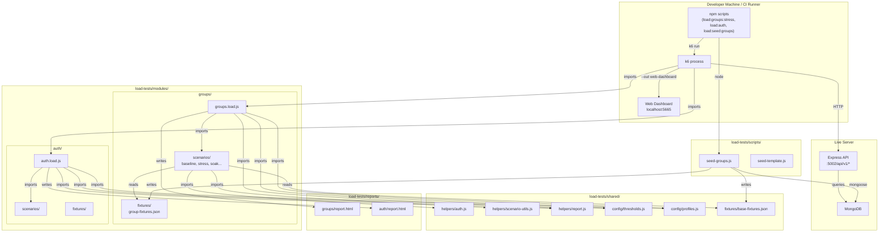
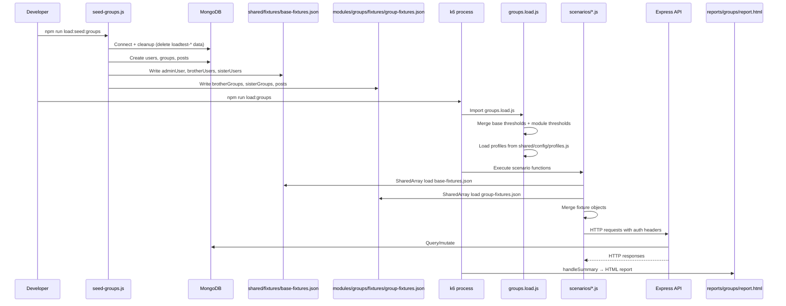

# Design Document: load-test-folder-restructure

## Overview

This document describes the technical design for restructuring the flat `load-tests/` folder into a scalable, module-based organization supporting all 18 API modules. The restructure introduces a `modules/` directory with per-module scenarios and fixtures, a `shared/` directory for cross-cutting helpers and configuration, module-wise reports, and updated npm scripts with module prefixes.

### Key Design Decisions

- **Module isolation**: Each API module gets its own directory with scenarios, fixtures, and an entry point. Modules are independent — adding a new module requires no changes to existing modules or shared code.
- **Shared extraction**: Common helpers (auth, scenario-utils, report) and configuration (thresholds, profiles) move to `shared/` to eliminate duplication across modules.
- **Fixture splitting**: Base fixtures (users/tokens) shared across all modules live in `shared/fixtures/`. Module-specific data (groups, posts) lives in `modules/{name}/fixtures/`.
- **Backward compatibility first**: Existing npm scripts, vitest tests, and CI pipelines continue working unchanged. The Groups module serves as the reference implementation.
- **Convention over configuration**: Standard directory layout and naming conventions mean new modules follow a predictable pattern without custom wiring.

---

## Architecture

### Target Directory Structure

```
load-tests/
├── modules/
│   ├── groups/
│   │   ├── scenarios/
│   │   │   ├── baseline.js
│   │   │   ├── chaos.js
│   │   │   ├── read-load.js
│   │   │   ├── role-auth.js
│   │   │   ├── soak.js
│   │   │   ├── spike.js
│   │   │   ├── stress.js
│   │   │   ├── user-journey.js
│   │   │   └── write-load.js
│   │   ├── fixtures/
│   │   │   └── group-fixtures.json
│   │   └── groups.load.js          # Module entry point
│   ├── auth/
│   │   ├── scenarios/
│   │   ├── fixtures/
│   │   └── auth.load.js
│   ├── users/
│   │   ├── scenarios/
│   │   ├── fixtures/
│   │   └── users.load.js
│   └── ... (15 more modules)
├── shared/
│   ├── helpers/
│   │   ├── auth.js                  # Token/header utilities
│   │   ├── scenario-utils.js        # Stage/phase/URL utilities
│   │   └── report.js                # Reusable handleSummary
│   ├── config/
│   │   ├── thresholds.js            # Base threshold definitions
│   │   └── profiles.js              # Load profile stage arrays
│   └── fixtures/
│       └── base-fixtures.json       # Shared users/tokens
├── scripts/
│   ├── seed-groups.js               # Groups seed script
│   ├── seed-template.js             # Template for new modules
│   └── ... (per-module seed scripts)
├── __tests__/
│   ├── groups/
│   │   └── advanced-scenarios.test.js
│   └── shared/
│       ├── auth.test.js
│       ├── scenario-utils.test.js
│       └── report.test.js
├── reports/
│   ├── groups/
│   │   ├── report.html
│   │   └── results.json
│   ├── auth/
│   │   └── report.html
│   └── report.html                  # Legacy fallback
└── README.md
```

### Component Diagram



### Data Flow Diagram



---

## Components and Interfaces

### Component 1: Module Entry Point (`{module-name}.load.js`)

Each module has a single entry point file that serves as the k6 main script. It:
1. Imports all scenario exec functions from `./scenarios/`
2. Imports base thresholds from `../../shared/config/thresholds.js`
3. Imports profiles from `../../shared/config/profiles.js`
4. Imports the reusable `handleSummary` from `../../shared/helpers/report.js`
5. Defines k6 `options` with scenario configurations
6. Re-exports exec functions for k6 to discover

**Pseudocode: `modules/groups/groups.load.js`**

```js
import { SharedArray } from 'k6/data';
import { Counter } from 'k6/metrics';
import { createHandleSummary } from '../../shared/helpers/report.js';
import { THRESHOLDS } from '../../shared/config/thresholds.js';

// Import exec functions from scenarios
import { runBaseline } from './scenarios/baseline.js';
import { runReadLoad } from './scenarios/read-load.js';
import { runWriteLoad } from './scenarios/write-load.js';
import { runUserJourney } from './scenarios/user-journey.js';
import { runSpike } from './scenarios/spike.js';
import { runRoleAuth } from './scenarios/role-auth.js';

// Re-export for k6 executor routing
export { runBaseline, runReadLoad, runWriteLoad, runUserJourney, runSpike, runRoleAuth };

// Custom metrics
export const readCheckFailures = new Counter('read_check_failures');
export const authBypassCount = new Counter('auth_bypass_count');

// k6 options — identical to original group.load.js
export const options = {
  scenarios: {
    baseline: {
      executor: 'per-vu-iterations',
      vus: 1,
      iterations: 1,
      exec: 'runBaseline',
      startTime: '0s',
    },
    read_load: {
      executor: 'constant-vus',
      vus: 10,
      duration: '30s',
      exec: 'runReadLoad',
      startTime: '5s',
    },
    write_load: {
      executor: 'constant-vus',
      vus: 5,
      duration: '30s',
      exec: 'runWriteLoad',
      startTime: '5s',
    },
    user_journey: {
      executor: 'constant-vus',
      vus: 5,
      duration: '30s',
      exec: 'runUserJourney',
      startTime: '5s',
    },
    role_auth: {
      executor: 'constant-vus',
      vus: 5,
      duration: '10s',
      exec: 'runRoleAuth',
      startTime: '5s',
    },
    spike: {
      executor: 'ramping-vus',
      startVUs: 0,
      stages: [
        { duration: '5s', target: 3 },
        { duration: '10s', target: 15 },
        { duration: '5s', target: 3 },
      ],
      exec: 'runSpike',
      startTime: '40s',
    },
  },
  thresholds: { ...THRESHOLDS },
};

// Default function (SKIP_LOAD_TESTS guard)
export default function () {
  if (__ENV.SKIP_LOAD_TESTS === 'true') return;
}

// Module-specific report generation
export const handleSummary = createHandleSummary('groups');
```

### Component 2: Shared Report Helper (`shared/helpers/report.js`)

A reusable factory function that generates a `handleSummary` function for any module. Uses k6's remote imports for HTML report generation and text summary formatting.

**Pseudocode: `shared/helpers/report.js`**

```js
import { htmlReport } from 'https://raw.githubusercontent.com/benc-uk/k6-reporter/main/dist/bundle.js';
import { textSummary } from 'https://jslib.k6.io/k6-summary/0.0.1/index.js';

/**
 * Create a handleSummary function for a specific module.
 * @param {string|undefined} moduleName - Module name in kebab-case (e.g., 'groups', 'auth')
 * @returns {function} k6 handleSummary function
 */
export function createHandleSummary(moduleName) {
  return function handleSummary(data) {
    const reportPath = moduleName
      ? `load-tests/reports/${moduleName}/report.html`
      : 'load-tests/reports/report.html';

    return {
      [reportPath]: htmlReport(data),
      stdout: textSummary(data, { indent: ' ', enableColors: true }),
    };
  };
}
```

### Component 3: Shared Configuration (`shared/config/`)

#### `shared/config/thresholds.js`

Exports the base threshold object used by all modules. Module entry points can extend or override specific keys.

```js
// Base thresholds — scenario-tagged metrics
export const THRESHOLDS = {
  'http_req_duration{scenario:"baseline"}':     ['p(95)<500'],
  'http_req_duration{scenario:"read_load"}':    ['p(95)<5000'],
  'http_req_failed{scenario:"read_load"}':      ['rate<0.05'],
  'http_req_duration{scenario:"write_load"}':   ['p(95)<5000'],
  'http_req_failed{scenario:"write_load"}':     ['rate<0.10'],
  'http_req_duration{scenario:"user_journey"}': ['p(95)<8000'],
  'http_req_failed{scenario:"spike"}':          ['rate<0.10'],
  'checks{scenario:"role_auth"}':               ['rate>0.95'],
};
```

#### `shared/config/profiles.js`

Centralizes load profile definitions. Extracts the stage-generation logic from `scenario-utils.js` into a configuration-focused module.

**Pseudocode: `shared/config/profiles.js`**

```js
'use strict';

/**
 * Get stress test stages based on environment profile.
 * @param {string|undefined} profileValue - 'production' or anything else (defaults to local)
 * @returns {Array<{duration: string, target: number}>}
 */
function getStressProfile(profileValue) {
  if (profileValue === 'production') {
    return [
      { duration: '2m', target: 50 },
      { duration: '5m', target: 50 },
      { duration: '2m', target: 100 },
      { duration: '5m', target: 100 },
      { duration: '2m', target: 200 },
      { duration: '5m', target: 200 },
      { duration: '2m', target: 300 },
      { duration: '5m', target: 300 },
      { duration: '10m', target: 0 },
    ];
  }
  return [
    { duration: '1m', target: 10 },
    { duration: '2m', target: 10 },
    { duration: '1m', target: 25 },
    { duration: '2m', target: 25 },
    { duration: '1m', target: 50 },
    { duration: '2m', target: 50 },
    { duration: '1m', target: 75 },
    { duration: '2m', target: 75 },
    { duration: '1m', target: 100 },
    { duration: '2m', target: 100 },
    { duration: '2m', target: 0 },
  ];
}

/**
 * Get soak test stages based on environment profile.
 * @param {string|undefined} profileValue - 'production' or anything else (defaults to local)
 * @returns {Array<{duration: string, target: number}>}
 */
function getSoakProfile(profileValue) {
  if (profileValue === 'production') {
    return [
      { duration: '2m', target: 20 },
      { duration: '4h', target: 20 },
      { duration: '2m', target: 0 },
    ];
  }
  return [
    { duration: '2m', target: 20 },
    { duration: '30m', target: 20 },
    { duration: '2m', target: 0 },
  ];
}

module.exports = { getStressProfile, getSoakProfile };
```

### Component 4: Shared Helpers (`shared/helpers/`)

#### `shared/helpers/auth.js`

Identical to the current `helpers/auth.js` — pure CommonJS module with `getUser`, `getToken`, `getAuthHeaders`. No changes to function signatures or behavior.

#### `shared/helpers/scenario-utils.js`

Identical to the current `helpers/scenario-utils.js` — pure CommonJS module with `getStressStages`, `getSoakStages`, `classifyPhase`, `resolveBaseUrl`. No changes to function signatures or behavior.

### Component 5: Fixture Loading Pattern

Scenarios need both base fixtures (users/tokens) and module-specific fixtures (groups/posts). The loading pattern merges them at k6 init time:

**Pseudocode: Fixture loading in a scenario file**

```js
import { SharedArray } from 'k6/data';

// Load base fixtures (shared users/tokens)
const baseFixtures = new SharedArray('base-fixtures', function () {
  return [JSON.parse(open('../../../shared/fixtures/base-fixtures.json'))];
})[0];

// Load module-specific fixtures (groups, posts)
const moduleFixtures = new SharedArray('group-fixtures', function () {
  return [JSON.parse(open('../fixtures/group-fixtures.json'))];
})[0];

// Merge: module keys override base keys
const fixtures = { ...baseFixtures, ...moduleFixtures };
```

### Component 6: Seed Script Organization (`scripts/`)

**Pseudocode: `scripts/seed-groups.js`**

```js
'use strict';
require('ts-node').register({ project: path.join(__dirname, '../../tsconfig.json'), transpileOnly: true });
require('dotenv').config({ path: path.join(__dirname, '../../.env') });

const mongoose = require('mongoose');
const path = require('path');
const fs = require('fs');

// Paths for fixture output
const BASE_FIXTURES_PATH = path.join(__dirname, '../shared/fixtures/base-fixtures.json');
const MODULE_FIXTURES_PATH = path.join(__dirname, '../modules/groups/fixtures/group-fixtures.json');

async function seed() {
  // 1. Connect to MongoDB
  // 2. Idempotent cleanup (delete loadtest-* users, load-testing groups)
  // 3. Create users (admin, brothers, sisters)
  // 4. Create groups and memberships
  // 5. Create posts
  // 6. Write base-fixtures.json (adminUser, brotherUsers, sisterUsers)
  // 7. Write group-fixtures.json (brotherGroups, sisterGroups, posts)
  // 8. Disconnect and exit
}

seed().then(() => process.exit(0)).catch(err => {
  console.error('[seed-groups] FATAL:', err.message);
  process.exit(1);
});
```

**Pseudocode: `scripts/seed-template.js`**

```js
/**
 * seed-{module-name}.js — Load test fixture generator for {Module Name}
 *
 * Usage: node load-tests/scripts/seed-{module-name}.js
 * Requires: MONGODB_URI (or DATABASE_URL) and JWT_SECRET in environment.
 *
 * Copy this template and replace {module-name} placeholders.
 */

'use strict';
require('ts-node').register({ project: path.join(__dirname, '../../tsconfig.json'), transpileOnly: true });
require('dotenv').config({ path: path.join(__dirname, '../../.env') });

const mongoose = require('mongoose');
const path = require('path');
const fs = require('fs');

// ── Configuration ─────────────────────────────────────────────────────────────
const MODULE_NAME = '{module-name}';  // Replace with actual module name
const BASE_FIXTURES_PATH = path.join(__dirname, '../shared/fixtures/base-fixtures.json');
const MODULE_FIXTURES_PATH = path.join(__dirname, `../modules/${MODULE_NAME}/fixtures/${MODULE_NAME}-fixtures.json`);

// ── Import models ─────────────────────────────────────────────────────────────
// const { YourModel } = require('../../src/app/modules/{module-name}/{module-name}.model');

async function seed() {
  // ── Step 1: Connect ─────────────────────────────────────────────────────────
  const MONGODB_URI = process.env.LOAD_TEST_DB || process.env.DATABASE_URL || process.env.MONGODB_URI;
  if (!MONGODB_URI) { console.error('[seed] No MongoDB URI'); process.exit(1); }
  await mongoose.connect(MONGODB_URI);

  // ── Step 2: Idempotent cleanup ──────────────────────────────────────────────
  // Delete previously seeded data for this module
  // await YourModel.deleteMany({ /* cleanup criteria */ });

  // ── Step 3: Create module-specific data ─────────────────────────────────────
  // const items = await YourModel.insertMany([...]);

  // ── Step 4: Write module fixtures ───────────────────────────────────────────
  const moduleFixtures = {
    // items: items.map(i => ({ id: i._id.toString(), ... })),
  };
  fs.mkdirSync(path.dirname(MODULE_FIXTURES_PATH), { recursive: true });
  fs.writeFileSync(MODULE_FIXTURES_PATH, JSON.stringify(moduleFixtures, null, 2));

  // ── Step 5: Merge shared fixtures (if creating new users) ───────────────────
  // Only write base-fixtures.json if this module creates shared users
  // Otherwise, rely on existing base-fixtures.json from seed-groups.js

  await mongoose.disconnect();
}

seed().then(() => process.exit(0)).catch(err => {
  console.error(`[seed-${MODULE_NAME}] FATAL:`, err.message);
  mongoose.disconnect().catch(() => {});
  process.exit(1);
});
```

### Component 7: NPM Script Patterns

**Script naming convention:**

| Pattern | Example | Description |
|---------|---------|-------------|
| `load:{module}` | `load:groups` | Run all scenarios for a module |
| `load:{module}:{scenario}` | `load:groups:stress` | Run a single scenario |
| `load:seed:{module}` | `load:seed:groups` | Seed fixtures for a module |
| `load:test` | (backward compat) | Alias → `load:groups` |
| `load:stress` | (backward compat) | Alias → `load:groups:stress` |
| `load:soak` | (backward compat) | Alias → `load:groups:soak` |
| `load:chaos` | (backward compat) | Alias → `load:groups:chaos` |

**package.json script additions:**

```json
{
  "load:groups": "k6 run --out web-dashboard load-tests/modules/groups/groups.load.js",
  "load:groups:stress": "k6 run --out web-dashboard load-tests/modules/groups/scenarios/stress.js",
  "load:groups:soak": "k6 run --out web-dashboard load-tests/modules/groups/scenarios/soak.js",
  "load:groups:chaos": "k6 run --out web-dashboard load-tests/modules/groups/scenarios/chaos.js",
  "load:groups:baseline": "k6 run load-tests/modules/groups/groups.load.js --env SCENARIO=baseline",
  "load:seed:groups": "node load-tests/scripts/seed-groups.js",
  "load:test": "k6 run --out web-dashboard load-tests/modules/groups/groups.load.js",
  "load:seed": "node load-tests/scripts/seed-groups.js",
  "load:stress": "k6 run --out web-dashboard load-tests/modules/groups/scenarios/stress.js",
  "load:soak": "k6 run --out web-dashboard load-tests/modules/groups/scenarios/soak.js",
  "load:chaos": "k6 run --out web-dashboard load-tests/modules/groups/scenarios/chaos.js",
  "load:report": "k6 run load-tests/modules/groups/groups.load.js",
  "load:ci": "k6 run load-tests/modules/groups/groups.load.js --out json=load-tests/reports/groups/results.json"
}
```

---

## Data Models

### Base Fixtures Schema (`shared/fixtures/base-fixtures.json`)

Contains user accounts and tokens shared across all modules:

```json
{
  "adminUser": {
    "id": "<ObjectId string>",
    "email": "loadtest-admin@test.com",
    "token": "<JWT string>"
  },
  "brotherUsers": [
    { "id": "<ObjectId>", "email": "loadtest-brother-0@test.com", "token": "<JWT>" }
  ],
  "sisterUsers": [
    { "id": "<ObjectId>", "email": "loadtest-sister-0@test.com", "token": "<JWT>" }
  ]
}
```

### Module Fixtures Schema (`modules/groups/fixtures/group-fixtures.json`)

Contains Groups-specific test data:

```json
{
  "brotherGroups": [
    { "id": "<ObjectId>", "name": "Load Test Brothers Group 0" }
  ],
  "sisterGroups": [
    { "id": "<ObjectId>", "name": "Load Test Sisters Group 0" }
  ],
  "posts": [
    { "id": "<ObjectId>", "groupId": "<ObjectId>" }
  ]
}
```

### Merged Fixtures (Runtime)

At k6 init time, scenarios merge base + module fixtures via object spread:

```js
const fixtures = { ...baseFixtures, ...moduleFixtures };
// Result:
// {
//   adminUser: { ... },        // from base
//   brotherUsers: [ ... ],     // from base
//   sisterUsers: [ ... ],      // from base
//   brotherGroups: [ ... ],    // from module
//   sisterGroups: [ ... ],     // from module
//   posts: [ ... ],            // from module
// }
```

**Merge semantics**: Module-specific keys override base keys if there's a naming collision. In practice, base fixtures contain user data and module fixtures contain domain-specific data, so collisions are unlikely.

### Import Path Resolution

From a scenario file at `modules/groups/scenarios/baseline.js`:

| Target | Relative Path |
|--------|---------------|
| `shared/helpers/auth.js` | `../../../shared/helpers/auth.js` |
| `shared/helpers/scenario-utils.js` | `../../../shared/helpers/scenario-utils.js` |
| `shared/fixtures/base-fixtures.json` | `../../../shared/fixtures/base-fixtures.json` |
| `modules/groups/fixtures/group-fixtures.json` | `../fixtures/group-fixtures.json` |
| `modules/groups/groups.load.js` | `../groups.load.js` |

---

## Correctness Properties

*A property is a characteristic or behavior that should hold true across all valid executions of a system — essentially, a formal statement about what the system should do. Properties serve as the bridge between human-readable specifications and machine-verifiable correctness guarantees.*

### Property 1: Report Path Construction

*For any* valid kebab-case module name string, the `createHandleSummary` function SHALL return a handleSummary function that produces an object with a key matching `load-tests/reports/{moduleName}/report.html` and a `stdout` key. When the module name is empty or undefined, the path SHALL fall back to `load-tests/reports/report.html`.

**Validates: Requirements 3.3, 3.5, 6.1, 6.3**

### Property 2: Threshold Merge Semantics

*For any* base threshold object and any module-specific threshold object, merging via `{ ...baseThresholds, ...moduleThresholds }` SHALL produce an object where: (a) all keys from the module object are present with their module values, (b) all keys from the base object that do not appear in the module object are present with their base values, and (c) no other keys exist.

**Validates: Requirements 4.3**

### Property 3: Fixture Merge Semantics

*For any* base fixture object and any module fixture object, merging via `{ ...baseFixtures, ...moduleFixtures }` SHALL produce an object where: (a) all keys from the module fixture are present with their module values, (b) all keys from the base fixture that do not appear in the module fixture are present with their base values, and (c) the resulting object contains exactly the union of keys from both inputs.

**Validates: Requirements 5.3, 5.4**

### Property 4: Auth Helper Round-Robin Distribution

*For any* valid fixtures object with N users in a role pool and any VU index (0–999), `getUser(fixtures, role, vuIndex)` SHALL return the user at index `vuIndex % N`, ensuring all VU indices map to a valid user without out-of-bounds access.

**Validates: Requirements 3.1, 10.3**

### Property 5: Profile Selection Defaults to Local

*For any* string value that is not exactly `"production"`, the profile functions (`getStressProfile`, `getSoakProfile`) SHALL return the local profile (lower VU counts, shorter durations). When the value is `undefined` or empty, the local profile SHALL also be returned.

**Validates: Requirements 4.2, 4.4**

---

## Error Handling

### Seed Script Failures

| Error Condition | Behavior |
|----------------|----------|
| Missing `MONGODB_URI` env var | Log error message, exit code 1 |
| Missing `JWT_SECRET` env var | Log error message, exit code 1 |
| MongoDB connection failure | Log error with reason, exit code 1 |
| Data creation failure (duplicate key, validation) | Log error, disconnect, exit code 1 |
| Fixture file write failure (permissions) | Log error, disconnect, exit code 1 |

### k6 Runtime Errors

| Error Condition | Behavior |
|----------------|----------|
| Missing fixture file | k6 `open()` throws at init — test aborts with clear error |
| Invalid fixture JSON | k6 `JSON.parse` throws at init — test aborts |
| Threshold breach | k6 exits with code 99 (CI detects as failure) |
| `SKIP_LOAD_TESTS=true` | Default function returns immediately, exit code 0 |
| Network error to API | k6 records as failed request, counts toward `http_req_failed` threshold |

### Report Generation Errors

| Error Condition | Behavior |
|----------------|----------|
| Empty/undefined module name in `createHandleSummary` | Falls back to `load-tests/reports/report.html` |
| Report directory doesn't exist | k6 creates parent directories automatically when writing via `handleSummary` |
| HTML report library unavailable (network) | k6 logs warning, stdout summary still generated |

---

## Testing Strategy

### Dual Testing Approach

This feature uses both unit tests and property-based tests:

- **Property-based tests** (fast-check, 100+ iterations): Verify universal properties of shared helpers and merge semantics
- **Unit tests** (vitest): Verify specific examples, integration points, and structural correctness

### Property-Based Testing Configuration

- **Library**: `fast-check` (already in devDependencies)
- **Minimum iterations**: 100 per property test
- **Tag format**: `Feature: load-test-folder-restructure, Property {N}: {description}`

### Test Organization

```
load-tests/__tests__/
├── groups/
│   └── advanced-scenarios.test.js    # Existing PBT tests (must pass unchanged)
└── shared/
    ├── auth.test.js                  # Property 4: round-robin distribution
    ├── scenario-utils.test.js        # Property 5: profile selection
    └── report.test.js                # Property 1: report path construction
```

### Property Test Implementation Plan

| Property | Test File | What's Generated | What's Asserted |
|----------|-----------|-----------------|-----------------|
| 1: Report Path | `__tests__/shared/report.test.js` | Random kebab-case strings, empty/undefined | Output object has correct path key and stdout key |
| 2: Threshold Merge | `__tests__/shared/thresholds.test.js` | Random threshold objects with string[] values | Merged object has correct key precedence |
| 3: Fixture Merge | `__tests__/shared/fixtures.test.js` | Random fixture objects with various keys | Merged object has correct key precedence |
| 4: Auth Round-Robin | `__tests__/shared/auth.test.js` | Random vuIndex (0–999), fixture pools of varying sizes | Returned user matches pool[vuIndex % pool.length] |
| 5: Profile Selection | `__tests__/shared/scenario-utils.test.js` | Random non-"production" strings | Returns local profile stages |

### Backward Compatibility Verification

The existing 4 property test suites in `__tests__/groups/advanced-scenarios.test.js` MUST pass without modification after the restructure:

1. **BASE_URL Resolution** — Tests `resolveBaseUrl` from relocated `shared/helpers/scenario-utils.js`
2. **Environment-Based Profile Selection** — Tests `getStressStages`/`getSoakStages` from relocated helpers
3. **Fixture-Based Request Distribution** — Tests modulo distribution logic
4. **Soak Phase Classification** — Tests `classifyPhase` from relocated helpers

The only change needed is updating the import path in the test file from `'../helpers/scenario-utils.js'` to `'../../shared/helpers/scenario-utils.js'`.

### Migration Verification Checklist

- [ ] All 9 scenario files exist under `modules/groups/scenarios/`
- [ ] `groups.load.js` exports same 6 exec functions
- [ ] k6 options in `groups.load.js` match original VU counts, durations, stages
- [ ] Thresholds in `shared/config/thresholds.js` match original values
- [ ] `npm run load:test` executes `modules/groups/groups.load.js`
- [ ] `npm run load:seed` executes `scripts/seed-groups.js`
- [ ] `npm run load:stress` executes Groups stress scenario
- [ ] Vitest passes all existing property tests
- [ ] Report generated to `reports/groups/report.html`
