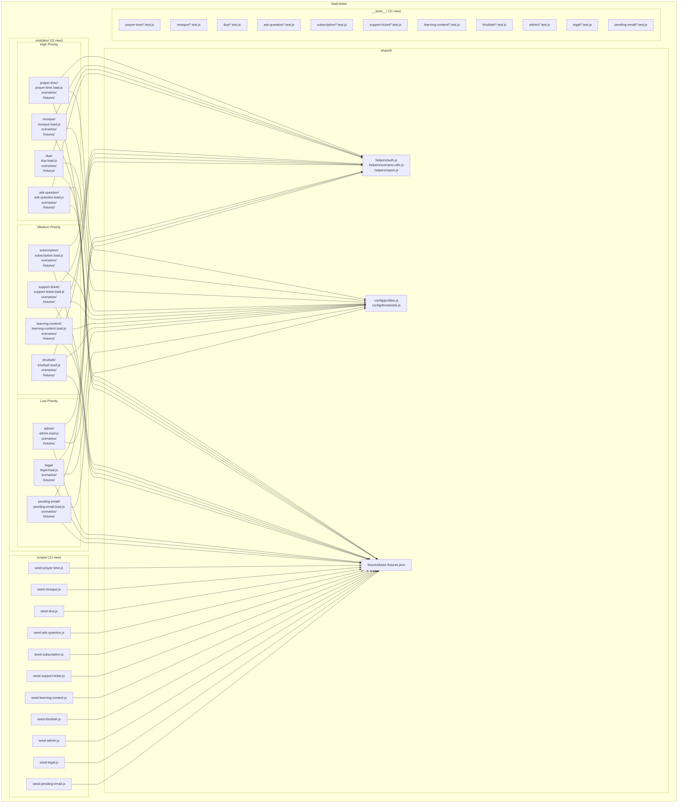

# Design Document: Remaining Module Load Tests

## Overview

This design extends the existing k6-based load testing infrastructure to cover the remaining 11 API modules: Prayer-Time, Mosque, Dua, Ask-Question, Subscription, Support-Ticket, Learning-Content, Khutbah, Admin, Legal, and Pending-Email. Each module receives a complete load testing suite following the structural and behavioral patterns established by the Groups reference implementation and the multi-module-load-tests spec (Auth, Chat, Connections, Users, Notifications).

The design prioritizes:
- **Consistency**: All modules follow the same directory structure, import patterns, and naming conventions as the existing reference
- **Shared infrastructure reuse**: Authentication helpers, profiles, thresholds, and report generation are imported from `shared/` — no duplication
- **Idempotent seeding**: Each module's seed script can be re-run safely, cleaning up prior data before creating fresh fixtures
- **Property-based test coverage**: Each module includes fast-check property tests verifying configuration validity and fixture distribution logic
- **Priority-based implementation order**: High-priority user-facing modules first, admin/internal modules last

### Key Design Decisions

1. **Module-per-directory isolation**: Each module is self-contained under `load-tests/modules/{name}/` with its own scenarios, fixtures, and entry point. This allows independent execution and seeding.
2. **Shared base fixtures**: All modules read user accounts from `shared/fixtures/base-fixtures.json` (created by `seed-groups.js`). Module-specific seed scripts only create module-specific data (mosques, duas, questions, etc.).
3. **Rate-limit awareness for Subscription**: The Subscription module includes a dedicated rate-limit validation scenario and paces stress/soak scenarios to avoid 429 interference on Apple/Google verify endpoints.
4. **Public endpoint handling**: Prayer-Time, Khutbah, and Legal modules have public (unauthenticated) endpoints. Their scenarios still load base fixtures for admin CRUD testing but skip auth headers for public reads.
5. **Geo-query scenario for Prayer-Time**: A specialized scenario type that generates diverse latitude/longitude pairs to stress-test the prayer time calculation engine across coordinate ranges.
6. **Content engagement pattern**: Learning-Content combines read-heavy browsing with write operations (likes, comments), requiring both read-load and write-load scenarios.

## Architecture



### Scenario Types per Module

| Module | baseline | stress | spike | read-load | write-load | user-journey | geo-query | rate-limit |
|--------|----------|--------|-------|-----------|------------|--------------|-----------|------------|
| Prayer-Time | ✓ | ✓ | ✓ | — | — | — | ✓ | — |
| Mosque | ✓ | ✓ | — | ✓ | — | ✓ | — | — |
| Dua | ✓ | ✓ | — | ✓ | — | ✓ | — | — |
| Ask-Question | ✓ | ✓ | — | ✓ | ✓ | ✓ | — | — |
| Subscription | ✓ | ✓ | — | ✓ | ✓ | ✓ | — | ✓ |
| Support-Ticket | ✓ | ✓ | — | ✓ | ✓ | ✓ | — | — |
| Learning-Content | ✓ | ✓ | — | ✓ | ✓ | ✓ | — | — |
| Khutbah | ✓ | ✓ | — | ✓ | — | ✓ | — | — |
| Admin | ✓ | ✓ | — | ✓ | — | — | — | — |
| Legal | ✓ | ✓ | — | ✓ | — | — | — | — |
| Pending-Email | ✓ | ✓ | — | — | ✓ | — | — | — |

## Components and Interfaces

### 1. Module Entry Points

Each module has a `{module-name}.load.js` file that:
- Imports all scenario exec functions from `./scenarios/`
- Re-exports them for k6 scenario executor discovery
- Defines `options` with scenario configurations (executor type, VUs, duration, startTime)
- Spreads `THRESHOLDS` from shared config
- Uses `createHandleSummary(moduleName)` for HTML report generation
- Implements `SKIP_LOAD_TESTS` environment variable check in the default export

```javascript
// Example: prayer-time.load.js structure
import { THRESHOLDS } from '../../shared/config/thresholds.js';
import { createHandleSummary } from '../../shared/helpers/report.js';
import { runBaseline } from './scenarios/baseline.js';
import { runStress } from './scenarios/stress.js';
import { runGeoQuery } from './scenarios/geo-query.js';
import { runSpike } from './scenarios/spike.js';

export { runBaseline, runStress, runGeoQuery, runSpike };

export const options = {
  scenarios: {
    baseline: { executor: 'per-vu-iterations', vus: 1, iterations: 1, exec: 'runBaseline', startTime: '0s' },
    stress: { executor: 'ramping-vus', startVUs: 0, stages: [...], exec: 'runStress', startTime: '5s' },
    geo_query: { executor: 'constant-vus', vus: 10, duration: '30s', exec: 'runGeoQuery', startTime: '5s' },
    spike: { executor: 'ramping-vus', startVUs: 0, stages: [...], exec: 'runSpike', startTime: '40s' },
  },
  thresholds: { ...THRESHOLDS },
};

export default function () {
  if (__ENV.SKIP_LOAD_TESTS === 'true') return;
}

export const handleSummary = createHandleSummary('prayer-time');
```

### 2. Scenario Files

Each scenario file exports:
- A named exec function (e.g., `runBaseline`, `runStress`, `runReadLoad`)
- Loads fixtures via k6 `SharedArray`
- Uses `getAuthHeaders` for authenticated requests (skipped for public endpoints)
- Uses `resolveBaseUrl` for URL construction (via `__ENV.BASE_URL` fallback)
- Uses `check()` for response assertions
- Uses `sleep()` for think-time simulation in user-journey scenarios

#### Scenario Patterns by Module Type

**Read-heavy content modules** (Mosque, Dua, Khutbah, Legal):
- `baseline.js` — 1 VU, 1 iteration: list all + get by ID
- `read-load.js` — 10 VUs, 30s: concurrent list + detail reads
- `stress.js` — ramping VUs: mixed reads to find throughput ceiling
- `user-journey.js` — 5 VUs, 30s: list → detail → paginated list

**Mixed read/write modules** (Ask-Question, Support-Ticket, Learning-Content):
- `baseline.js` — 1 VU, 1 iteration: basic CRUD verification
- `read-load.js` — 10 VUs, 30s: concurrent read operations
- `write-load.js` — 5 VUs, 30s: concurrent write operations
- `stress.js` — ramping VUs: mixed read/write operations
- `user-journey.js` — 5 VUs, 30s: complete lifecycle flow

**Subscription module** (rate-limit aware):
- `baseline.js` — 1 VU, 1 iteration: check subscription status
- `read-load.js` — 10 VUs, 30s: concurrent status checks + admin analytics
- `write-load.js` — 5 VUs, 30s: free plan selections (paced)
- `stress.js` — ramping VUs: mixed operations with pacing
- `user-journey.js` — 5 VUs, 30s: subscription lifecycle
- `rate-limit.js` — 1 VU, 15 iterations: exceed 30 req/min, assert 429

**Prayer-Time module** (geo-query focused):
- `baseline.js` — 1 VU, 1 iteration: single prayer time request
- `stress.js` — ramping VUs: randomized coordinates
- `geo-query.js` — 10 VUs, 30s: diverse geographic locations
- `spike.js` — burst pattern: simulates app-open at prayer time

**Admin-only modules** (Admin, Pending-Email):
- `baseline.js` — 1 VU, 1 iteration: basic endpoint verification
- `stress.js` — ramping VUs: concurrent admin requests
- `read-load.js` (Admin) / `write-load.js` (Pending-Email): concurrent operations

### 3. Seed Scripts

Each seed script follows `seed-template.js`:
1. Connect to MongoDB (using `LOAD_TEST_DB` / `DATABASE_URL` / `MONGODB_URI`)
2. Idempotent cleanup (delete data with `loadtest-` prefix)
3. Create module-specific test data
4. Write fixtures to `modules/{name}/fixtures/{name}-fixtures.json`
5. Disconnect and exit

#### Module-Specific Seed Data

| Module | Seeded Data | Fixture Output |
|--------|-------------|----------------|
| Prayer-Time | Geographic coordinate sets, calculation methods | Coordinate pairs, method enums |
| Mosque | 10 mosque records with locations | Mosque IDs, location data |
| Dua | 10 dua records with categories | Dua IDs |
| Ask-Question | 10 questions with user associations | Question IDs, user mappings |
| Subscription | 5 subscription records with plan types | Subscription IDs, plan types |
| Support-Ticket | 5 tickets with replies | Ticket IDs, message IDs |
| Learning-Content | 10 content items with comments | Content IDs, comment IDs |
| Khutbah | 10 khutbah records | Khutbah IDs |
| Admin | (no new data — uses existing base fixtures) | Admin user reference |
| Legal | 5 legal pages with known slugs | Page slugs |
| Pending-Email | 5 pending email records | Email IDs |

### 4. Property-Based Tests

Each module has a test file under `__tests__/{module-name}/` that:
- Uses vitest as the test runner
- Uses fast-check for property generation
- Tests fixture distribution (getUser with arbitrary VU indices)
- Tests scenario configuration validity (executor types, VU counts, durations)
- Runs minimum 100 iterations per property

### Interface: Shared Helpers

| Helper | Import Path | Purpose |
|--------|-------------|---------|
| `getUser(fixtures, role, vuIndex)` | `shared/helpers/auth.js` | Round-robin user selection from fixture pool |
| `getToken(fixtures, role, vuIndex)` | `shared/helpers/auth.js` | Extract JWT token for a user |
| `getAuthHeaders(fixtures, role, vuIndex)` | `shared/helpers/auth.js` | Build Authorization header |
| `resolveBaseUrl(envValue)` | `shared/helpers/scenario-utils.js` | Resolve API base URL |
| `getStressStages(profileValue)` | `shared/helpers/scenario-utils.js` | Get stress stage array |
| `getSoakStages(profileValue)` | `shared/helpers/scenario-utils.js` | Get soak stage array |
| `createHandleSummary(moduleName)` | `shared/helpers/report.js` | Generate module-specific HTML report |
| `THRESHOLDS` | `shared/config/thresholds.js` | Base k6 performance thresholds |
| `getStressProfile(profileValue)` | `shared/config/profiles.js` | Get stress profile stages |
| `getSoakProfile(profileValue)` | `shared/config/profiles.js` | Get soak profile stages |

## Data Models

### Fixture Structures

#### Base Fixtures (`shared/fixtures/base-fixtures.json`) — existing, shared by all
```json
{
  "adminUser": { "id": "string", "email": "string", "token": "string" },
  "brotherUsers": [{ "id": "string", "email": "string", "token": "string" }],
  "sisterUsers": [{ "id": "string", "email": "string", "token": "string" }]
}
```

#### Prayer-Time Fixtures (`modules/prayer-time/fixtures/prayer-time-fixtures.json`)
```json
{
  "coordinates": [
    { "latitude": 21.4225, "longitude": 39.8262, "label": "Mecca" },
    { "latitude": 24.4539, "longitude": 54.3773, "label": "Abu Dhabi" },
    { "latitude": 51.5074, "longitude": -0.1278, "label": "London" },
    { "latitude": 40.7128, "longitude": -74.0060, "label": "New York" },
    { "latitude": -33.8688, "longitude": 151.2093, "label": "Sydney" }
  ],
  "calculationMethods": ["MuslimWorldLeague", "Egyptian", "Karachi", "UmmAlQura", "NorthAmerica"],
  "dates": ["2024-01-15", "2024-06-21", "2024-12-21", "2024-03-20"]
}
```

#### Mosque Fixtures (`modules/mosque/fixtures/mosque-fixtures.json`)
```json
{
  "mosques": [
    { "id": "string", "name": "string", "latitude": "number", "longitude": "number" }
  ]
}
```

#### Dua Fixtures (`modules/dua/fixtures/dua-fixtures.json`)
```json
{
  "duas": [
    { "id": "string", "title": "string", "category": "string" }
  ]
}
```

#### Ask-Question Fixtures (`modules/ask-question/fixtures/ask-question-fixtures.json`)
```json
{
  "questions": [
    { "id": "string", "userId": "string", "text": "string", "isAnswered": "boolean" }
  ],
  "unansweredQuestionIds": ["string"]
}
```

#### Subscription Fixtures (`modules/subscription/fixtures/subscription-fixtures.json`)
```json
{
  "subscriptions": [
    { "id": "string", "userId": "string", "plan": "string", "status": "string" }
  ],
  "freeUsers": [{ "id": "string", "email": "string", "token": "string" }]
}
```

#### Support-Ticket Fixtures (`modules/support-ticket/fixtures/support-ticket-fixtures.json`)
```json
{
  "tickets": [
    { "id": "string", "userId": "string", "subject": "string", "status": "string" }
  ],
  "ticketMessages": [
    { "id": "string", "ticketId": "string", "senderId": "string" }
  ]
}
```

#### Learning-Content Fixtures (`modules/learning-content/fixtures/learning-content-fixtures.json`)
```json
{
  "contents": [
    { "id": "string", "title": "string", "type": "string" }
  ],
  "comments": [
    { "id": "string", "contentId": "string", "userId": "string" }
  ]
}
```

#### Khutbah Fixtures (`modules/khutbah/fixtures/khutbah-fixtures.json`)
```json
{
  "khutbahs": [
    { "id": "string", "title": "string", "topic": "string" }
  ]
}
```

#### Admin Fixtures (`modules/admin/fixtures/admin-fixtures.json`)
```json
{
  "adminUserRef": { "id": "string", "email": "string", "token": "string" }
}
```

#### Legal Fixtures (`modules/legal/fixtures/legal-fixtures.json`)
```json
{
  "pages": [
    { "slug": "string", "title": "string" }
  ],
  "knownSlugs": ["terms-of-service", "privacy-policy", "cookie-policy", "acceptable-use", "disclaimer"]
}
```

#### Pending-Email Fixtures (`modules/pending-email/fixtures/pending-email-fixtures.json`)
```json
{
  "pendingEmails": [
    { "id": "string", "to": "string", "subject": "string", "status": "string" }
  ]
}
```

### Seed Data Conventions

- All seeded data uses the `loadtest-` prefix for emails and identifiable fields
- Seed scripts are idempotent: they delete all `loadtest-` prefixed data before creating new data
- Module seed scripts read shared users from `base-fixtures.json` rather than creating duplicates
- Each seed script writes its output to the module's `fixtures/` directory
- Prayer-Time seed script creates coordinate/method fixture data (no database records needed — it's a calculation endpoint)

## Correctness Properties

*A property is a characteristic or behavior that should hold true across all valid executions of a system — essentially, a formal statement about what the system should do. Properties serve as the bridge between human-readable specifications and machine-verifiable correctness guarantees.*

### Property 1: Fixture-Based User Selection Validity

*For any* non-negative VU index (0–999) and any valid role ('admin', 'brother', 'sister'), calling `getUser(fixtures, role, vuIndex)` SHALL return a valid user object containing non-empty `id`, `email`, and `token` string fields, and the selection SHALL distribute across the pool via modulo arithmetic without ever producing an out-of-bounds index.

**Validates: Requirements 14.2, 17.1**

### Property 2: Scenario Configuration Validity

*For any* module entry point's scenario configuration object across all 11 new modules, every scenario SHALL have a valid k6 executor type (one of: 'per-vu-iterations', 'constant-vus', 'ramping-vus', 'shared-iterations', 'ramping-arrival-rate', 'constant-arrival-rate'), a positive VU count (or non-negative startVUs with at least one positive stage target for ramping executors), and a non-empty exec function name referencing an exported function.

**Validates: Requirements 13.2, 14.3**

### Property 3: Seed Script Idempotence

*For any* module seed script, executing the script twice in succession against the same database SHALL produce identical fixture JSON output, demonstrating that the cleanup phase fully removes prior seeded data before re-creating it.

**Validates: Requirements 12.2**

### Property 4: Fixture and Script Path Resolution

*For any* valid module name string from the set of 11 modules (matching the pattern `[a-z][a-z0-9-]*`), the fixture output path SHALL resolve to `load-tests/modules/{module-name}/fixtures/{module-name}-fixtures.json` and the NPM script path SHALL resolve to an existing file relative to the project root.

**Validates: Requirements 12.3, 15.4**

### Property 5: SKIP_LOAD_TESTS Bypass

*For any* module entry point, when the `SKIP_LOAD_TESTS` environment variable is set to the string `"true"`, the default export function SHALL return immediately without executing any HTTP requests or scenario logic.

**Validates: Requirements 13.5**

## Error Handling

### Seed Script Errors

| Error Condition | Behavior |
|----------------|----------|
| No MongoDB URI in environment | Log error message with module name, exit with code 1 |
| Database connection failure | Log connection error, exit with code 1 |
| Data creation failure | Disconnect from database, log error reason, exit with code 1 |
| Missing JWT_SECRET (if needed) | Log error message, exit with code 1 |
| Fixture directory doesn't exist | Create directory recursively via `fs.mkdirSync({ recursive: true })` |

### Scenario Runtime Errors

| Error Condition | Behavior |
|----------------|----------|
| Fixture file not found | k6 fails at startup with file-not-found error (scenario cannot run without fixtures) |
| API server unreachable | HTTP requests fail, k6 reports connection errors in summary |
| Rate limit exceeded (Subscription) | Rate-limit scenario asserts 429; stress/soak scenarios pace requests to avoid |
| Invalid auth token | Requests return 401; check assertions fail and are reported in summary |
| Public endpoint returns 404 | Check assertions fail; reported in k6 summary with endpoint tag |

### NPM Script Errors

| Error Condition | Behavior |
|----------------|----------|
| k6 not installed | NPM script fails with "command not found" |
| File path incorrect | k6 fails with "file not found" error |
| Threshold breach | k6 exits with non-zero code (threshold failure) |
| Seed script file not found | Node.js fails with MODULE_NOT_FOUND error |

### Rate-Limit Handling (Subscription Module)

| Scenario | Strategy |
|----------|----------|
| `rate-limit.js` | Intentionally exceeds 30 req/min from single user; asserts HTTP 429 |
| `stress.js` | Distributes requests across multiple VU users via round-robin; adds `sleep()` pacing |
| `write-load.js` | Uses `choose/free` endpoint (not rate-limited) for write throughput testing |
| `user-journey.js` | Single-user flow with natural think-time; stays well below rate limit |

## Testing Strategy

### Property-Based Tests (fast-check + vitest)

Each module gets a test file at `load-tests/__tests__/{module-name}/{module-name}.test.js` containing:

1. **User selection property** (Property 1): Verify `getUser` returns valid users for all generated VU indices (0–999) and all roles
2. **Configuration validity property** (Property 2): Verify the module's scenario options contain valid executors, positive VUs, and valid durations/stages

Configuration:
- Library: `fast-check` (already in devDependencies)
- Runner: `vitest` with pattern `load-tests/__tests__/**/*.test.js`
- Minimum iterations: 100 per property (`{ numRuns: 100 }`)
- Tag format: `Feature: remaining-module-load-tests, Property {N}: {description}`

### Unit Tests (Example-Based)

- Seed script error handling: verify exit code 1 on connection failure
- Fixture JSON structure validation: verify output matches expected schema
- Rate-limit pacing logic: verify sleep intervals keep requests below 30/min/user

### Integration Tests

Integration tests are run by executing the actual k6 scenarios against a running server with seeded data:
- `npm run load:seed:{module}` → seeds test data
- `npm run load:{module}:baseline` → verifies basic endpoint functionality
- Full suite: `npm run load:{module}` → runs all scenarios with thresholds

### Smoke Tests

Structural verification that all expected files exist and package.json scripts are registered:
- Verify directory structure matches reference implementation for all 11 modules
- Verify all NPM scripts resolve to existing files
- Verify shared imports are present in scenario files

### Test Execution Order

1. Run `npm run load:seed:groups` first (creates base fixtures shared by all modules)
2. Run module-specific seeds in priority order:
   - High: `npm run load:seed:prayer-time`, `load:seed:mosque`, `load:seed:dua`, `load:seed:ask-question`
   - Medium: `npm run load:seed:subscription`, `load:seed:support-ticket`, `load:seed:learning-content`, `load:seed:khutbah`
   - Low: `npm run load:seed:admin`, `load:seed:legal`, `load:seed:pending-email`
3. Run property tests: `npx vitest --run load-tests/__tests__/`
4. Run baseline scenarios: `npm run load:{module}:baseline` for each module
5. Run full load tests: `npm run load:{module}` for each module
